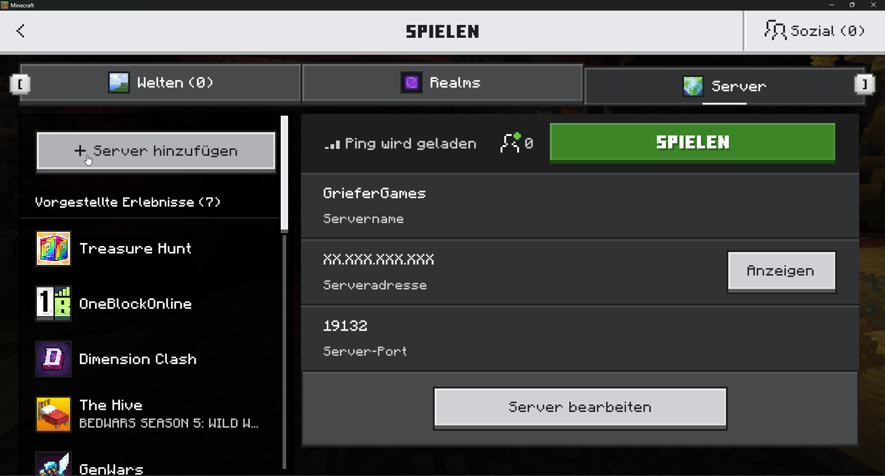

# ..in der Bedrock-Edition

Auf GrieferGames kannst du ebenfalls mit der Bedrock-Version spielen. Du spielst mit der Bedrock auf dem Java-Server von GrieferGames.

## Server hinzufügen

Um dich auf den Server zu verbinden, musst du einen neuen Multiplayer-Server hinzufügen.&#x20;

<figure><figcaption>
Optionen der Mehrspieler Serverliste in der Bedrock-Edition
</figcaption></figure>

Um dich mit GrieferGames in der Bedrock-Edition verbinden zu könnnen, sind folgende Angaben beim Punkt "Server hinzufügen" notwendig:&#x20;

* Serveradresse: `griefergames.net`
* Port: `19132`

<figure><figcaption>
Verbindungsinformationen Bedrock-Version
</figcaption></figure>

### Hinweise zur Bedrock-Edition

Unsere bisherige Entwicklung zeigt, dass das Beheben von Fehlern für eine Plattform, neue Fehler auf anderen erzeugt. Unser Fokus liegt daher auf der Weiterentwicklung der PC-/Mobile-Edition der Bedrock-Version.

Einige Konsolen-Anbieter verhindern das Anlegen eigener Server. Wir gestatten weiterhin das Verbinden mit Konsolen über diverse Umgehungsmöglichkeiten (eigener DNS-Server, virtuelle Server zur Weiterleitung, Apps etc.).&#x20;

Ein offizieller Support der Konsolen zum Verbinden ist leider nicht mehr möglich.

## Updates der Bedrock-Edition


<mark style="color:red;">**Achtung:**</mark> Da GrieferGames die Bedrock-Version über eine eigene Schnittstelle anbindet, brauchen wir bei jedem neuen Update des Spiels ein wenig Zeit, um diese Änderungen umzusetzen. \
\
Versuche, wenn möglich, die automatischen Updates deiner App zu deaktivieren.\
Hast du eine Beta-Version installiert, kannst du in der Regel nicht GrieferGames betreten.


Den aktuellen Stand zu Updates erfahrt ihr auf unserem [Discord-Server](https://discord.gg/abge).
