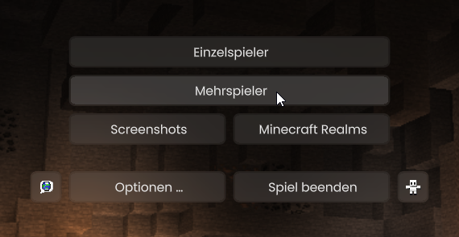
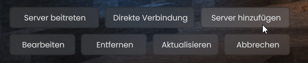

# ...in der Java-Edition

Um mit der Java-Version auf GrieferGames zu joinen, musst du den Server zu deiner Serverliste hinzufügen. Dazu wählst du im Minecraft-Menü den Reiter "Mehrspieler" aus und klickst dann auf den Button "Server hinzufügen".

<figure><figcaption>
Minecraft-Menü in der Java-Edition
</figcaption></figure>

<figure><figcaption>
Optionen der Mehrspieler-Serverliste in der Java-Edition
</figcaption></figure>

Trage dort als Serveradresse Folgendes ein: <mark style="color:orange;">**griefergames.net**</mark>

<figure><figcaption>
Verbindungsinformationen Java-Edition
</figcaption></figure>

## Direkte Verbindung auf das Cloud-Netzwerk


Die direkte Verbindung auf das Cloud-Netzwerk steht dir erst ab dem **Premium-Rang** zur Verfügung. Dies gilt auch für einen von einem Supreme-Spieler geschenkten Premium-Rang.


Zusätzlich zur Standard-Adresse gibt es für das Cloud-Netzwerk eine Möglichkeit, dich direkt mit dem Netzwerk zu verbinden. So kannst du auch gleichzeitig auf dem 1.8-Netzwerk und dem Cloud-Netzwerk aktiv sein.

Die Serveradresse für die direkte Verbindung lautet: <mark style="color:orange;">**cloud.griefergames.net**</mark>

<figure><figcaption>
Verbindungsinformationen Java-Edition Cloud-Direktverbindung
</figcaption></figure>
