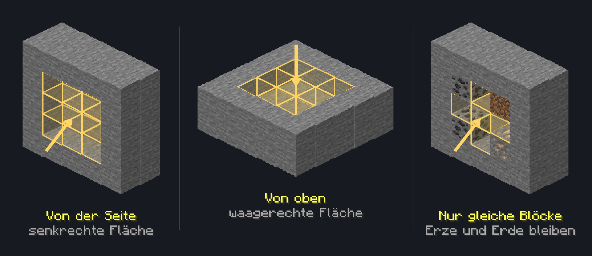

# Super-Werkzeuge

Super-Werkzeuge, auch 3x3-Tools genannt, bauen mit einem Schlag einen ganzen Bereich aus Blöcken ab. So gräbst du Tunnel und ebnest Flächen deutlich schneller als mit normalen Werkzeugen.

Super-Werkzeuge und die TimberTool-Axt gibt es z. B. als Gewinne im [Case-Opening](../features/case-opening.md).

## Die Werkzeuge

Zu den Super-Werkzeugen gehören z. B.:

* **Super-Spitzhacke**
* **Super-Axt**
* **Super-Schaufel**
* **Super-Hacke**
* **Himmlischer Erzspalter** (Spitzhacke)

Wie groß der Bereich ist, steht in der Beschreibung des Werkzeugs. Die meisten Super-Werkzeuge bauen **3x3** Blöcke ab, der Himmlische Erzspalter sogar **5x5** Blöcke.

## So funktioniert das Werkzeug

1. Super-Werkzeug in der Hand halten.
2. Einen Block abbauen, zu dem das Werkzeug passt, z. B. Stein mit der Spitzhacke oder Erde mit der Schaufel.
3. Die Blöcke im Bereich um diesen Block werden mit abgebaut.

Der Bereich richtet sich nach der Seite, an der du den Block abbaust. Von oben oder unten baust du eine waagerechte Fläche ab, von der Seite eine senkrechte, z. B. für einen Tunnel.


Es werden nur Blöcke derselben Art abgebaut wie der Block, den du abbaust. Baust du z. B. Stein ab, bleiben Erze und andere Blöcke im Bereich stehen.


<figure class="wiki-illus"><figcaption>Die Fläche liegt in der Ebene der Seite, die du anschlägst. Abgebaut werden nur Blöcke derselben Art wie der angeschlagene Block.</figcaption></figure>


* Verzauberungen wie Glück oder Behutsamkeit wirken auf alle Blöcke im Bereich.
* Blöcke, die du an dieser Stelle nicht abbauen darfst, z. B. auf fremden Grundstücken, bleiben stehen.


### Glas, Leuchtstein und Seelaternen

Für Glas, Leuchtstein und Seelaternen gibt es in Minecraft kein passendes Werkzeug. Super-Spitzhacken aus Eisen, Diamant oder Netherit bauen diese Blöcke trotzdem im ganzen Bereich ab. Das gilt auch für gefärbtes und getöntes Glas.

## Felder und Pfade anlegen

Mit der **Super-Hacke** legst du ganze Felder auf einmal an. Machst du per Rechtsklick einen Block zu **Ackerboden**, werden auch Erde, Grasblöcke und Trampelpfade im Bereich darum zu Ackerboden. **Grobe Erde** im Bereich wird dabei zu Erde.

Mit der **Super-Schaufel** legst du per Rechtsklick **Trampelpfade** im ganzen Bereich an. Umgewandelt werden alle Blöcke derselben Art wie der angeklickte Block.

## TimberTool-Axt

Die **TimberTool-Axt** fällt ganze Bäume auf einmal. Baust du damit einen Stamm ab, werden alle damit verbundenen Stämme mit abgebaut, bis zu **100** Stück auf einmal.
Laub bleiben stehen. Stämme, die nur über eine Kante oder Ecke verbunden sind, z. B. schräge Äste, werden nicht mitgefällt.


Die TimberTool-Axt unterscheidet nicht zwischen Bäumen und verbauten Stämmen. Baust du an einem Gebäude einen Stamm ab, werden auch alle damit verbundenen Stämme abgebaut.


## Hinweise


Hast du das [Perk](../features/perks.md) **Telekinese** aktiviert, landen auch die Drops aller Blöcke, die ein Super-Werkzeug oder die TimberTool-Axt zusätzlich abbaut, direkt in deinem Inventar.



Beim [Block des Tages](../features/block-des-tages.md) zählen alle Blöcke, die ein Super-Werkzeug abbaut.

