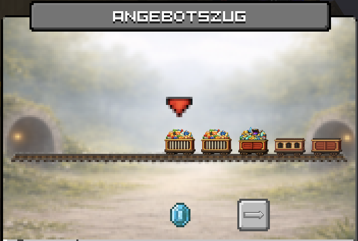
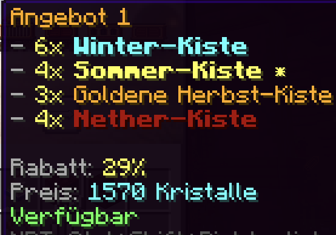

# Der Angebotszug

Der Angebotszug ist dein persönlicher Rabatt Händler für alle Kistensorten. 

## Wie das System funktioniert

Der Händler bringt wöchentlich 10 exklusive Angebote mit, die nur du hast. 

Jede Woche am Montag um 0:00 Uhr resettet sich der Zug und ihr bekommt ganz neue andere Angebote.

Den Angebotszug könnt ihr am Spawn direkt neben dem [CaseOpening](/funktionen/features/case-opening.md) finden. Dort könnt ihr nur das erste Angebot kaufen und die restlichen erst danach in der gezeigten Reihenfolge.
