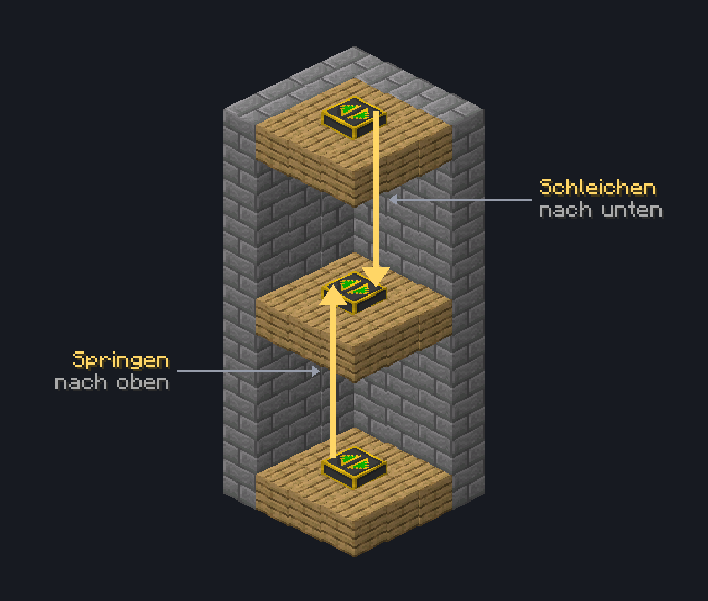

# ↕️ Aufzüge & Teleporter

Mit **Aufzügen** wechselst du schnell zwischen verschiedenen Höhen. Mit **Teleportern** springst du zwischen verschiedenen Punkten auf einem Grundstück hin und her.

## Aufzug

Platziere zwei oder mehr Aufzüge genau übereinander, also an derselben X- und Z-Koordinate. Der nächste Aufzug darf höchstens **100 Blöcke** höher oder tiefer liegen.

1. Auf einen Aufzug stellen.
2. Springen, um zum nächsten Aufzug darüber zu gelangen.
3. Schleichen, um zum nächsten Aufzug darunter zu gelangen.

<figure class="wiki-illus"><figcaption>Die Aufzüge stehen genau übereinander. Springen bringt dich zum nächsten Aufzug darüber, Schleichen zum nächsten darunter.</figcaption></figure>

Aufzüge bringen dich auch durch Blöcke hindurch. So erreichst du z. B. einen Keller oder ein oberes Stockwerk direkt.

### Aufzug aktivieren und deaktivieren

Mit einem Rechtsklick auf einen Aufzug schaltest du ihn zwischen aktiviert und deaktiviert um. Das können der Grundstücksbesitzer und Spieler mit Rechten auf dem Grundstück.


Aktivierte Aufzüge können alle Spieler benutzen. Deaktivierte Aufzüge können nur der Grundstücksbesitzer und Spieler mit Rechten auf dem Grundstück benutzen.


## Teleporter

Alle Teleporter auf einem Grundstück bilden automatisch ein Netzwerk mit einer festen Reihenfolge.

* **Springen** auf einem Teleporter bringt dich zum nächsten Teleporter.
* **Schleichen** bringt dich zum vorherigen Teleporter.
* Mit **Rechtsklick** öffnest du eine Übersicht der Teleporter und springst direkt zu einem beliebigen Punkt.

Teleporter kannst du nur auf deinem eigenen Grundstück platzieren und abbauen. Beim Abbauen bleibt der Teleporter als Item erhalten.


Wird das Grundstück zurückgesetzt oder gelöscht, werden auch alle Teleporter-Punkte darauf entfernt.


### Teleporter einstellen

Als Grundstücksbesitzer öffnest du über die Übersicht die **Einstellungen** eines Teleporters. Dort kannst du:

* den Teleporter umbenennen,
* ein Symbol wählen, entweder mit einem Item aus deinem Inventar oder aus den vorgegebenen Symbolen,
* die Reihenfolge der Teleporter ändern,
* festlegen, wer den Teleporter nutzen darf.

Für die Nutzung gibt es drei Stufen:

* **Öffentlich:** Alle Spieler können den Teleporter anwählen.
* **Vertraute:** Nur Spieler mit Rechten auf dem Grundstück können den Teleporter anwählen.
* **Privat:** Nur du kannst den Teleporter anwählen.


Teleporter, die ein Spieler nicht nutzen darf, werden ihm in der Übersicht nicht angezeigt und beim Springen oder Schleichen übersprungen.

