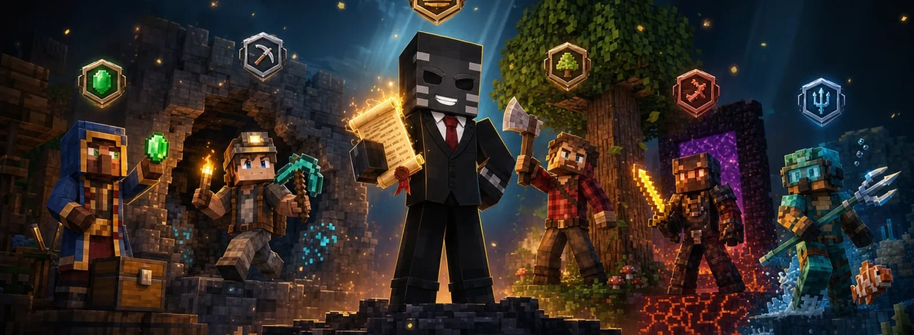

# 🧭 Berufe

<figure><figcaption>
Händler, Höhlenforscher, Axtperte, Netherstrike und Aqua-Expert
</figcaption></figure>

Mit dem Berufe-System erhältst du Berufe, welche sich aus deiner Spielweise ergeben. Du musst keinen Beruf auswählen und kannst auch keinen wechseln. Stattdessen wird ausgewertet, welche Systeme du nutzt, in welchen Welten und Biomen du unterwegs bist und welche Tätigkeiten du regelmäßig ausführst. Wer zum Beispiel viel im Auktionshaus handelt, wird zum Händler. Wer viel unter Tage abbaut, wird zum Höhlenforscher.

Jeder Spieler besitzt alle Berufe gleichzeitig. Für jeden Beruf sammelst du Punkte, mit denen du im Level aufsteigst und Titel freischaltest. Zusätzlich gibt es jeden Monat einen Wettbewerb mit Ligen und Belohnungen.


Das Berufe-System ist nicht mit dem [Job-System](job-system.md) zu verwechseln. Im Job-System geben Spieler Aufträge auf, welche von anderen Spielern beliefert werden. Das Beliefern von Aufträgen zählt jedoch für den Beruf Abenteurer, das Erstellen von Aufträgen für den Beruf Händler.


## Aktive Berufe

Es gibt zwei Gruppen von Berufen: globale Berufe und Minecraft-Berufe. Aus jeder Gruppe wird der Beruf, welcher deine aktuelle Spielweise am besten beschreibt, als aktiver Beruf angezeigt. Andere Spieler sehen bei dir also immer einen globalen Beruf und einen Minecraft-Beruf, zum Beispiel _Händler | Höhlenforscher_.

Welcher Beruf aktiv ist, hängt in erster Linie von deinem Verhalten im aktuellen Monat und den letzten Tagen ab. Dein bisheriger Fortschritt fließt nur zu einem kleinen Teil ein. Ein Spieler, der lange als Händler unterwegs war, kann daher in einem Monat als Abenteurer angezeigt werden, wenn er in diesem Monat hauptsächlich Aufgaben erledigt.

Eine Übersicht über alle deine Berufe findest du im `/profile`. Dort werden für jeden Beruf das Level, der Fortschritt, die Monatspunkte, der Titel, die aktuelle Liga und die Ergebnisse vergangener Monate angezeigt.


Für gesammelte Punkte wird keine Nachricht im Chat angezeigt. Eine Nachricht erhältst du nur bei einem Levelaufstieg, einem neuen Titel oder wenn sich deine Platzierung im Monatsranking verändert.


## Globale Berufe

Die globalen Berufe bewerten, wie du die Systeme des Servers nutzt.



Der Abenteurer bewertet die Nutzung der serverbezogenen Systeme. Punkte erhältst du für:

* abgeschlossene Aufgaben beim [Adventure-System](adventure-system.md). Tägliche Aufgaben zählen wenig, wöchentliche deutlich mehr und monatliche am meisten.
* das Beliefern von Aufträgen anderer Spieler im [Job-System](job-system.md). Teilbelieferungen zählen ebenfalls.
* gefundene Belohnungen beim [Block des Tages](block-des-tages.md)
* Fänge mit dem [Angel-System](angel-system.md). Für den Wechsel des Köders gibt es einen Bonus.

Mehr Punkte erhältst du, wenn du an einem Tag mehrere verschiedene Systeme nutzt. Angenommene, aber nicht abgeschlossene Aufgaben zählen nicht.



Der Händler bewertet die Teilnahme am Handel. Punkte erhältst du für:

* Gebote, eingestellte Angebote, Verkäufe und Käufe im [Auktionshaus](auktionshaus.md)
* das Erstellen von Aufträgen im [Job-System](job-system.md) sowie belieferte und abgeschlossene Aufträge
* Trades bei den [Händlern](die-handler.md) am Spawn

Am meisten zählen erfolgreiche Verkäufe, erfolgreiche Käufe und vollständig abgeschlossene Aufträge. Gebote zählen nur begrenzt pro Auktion.


Handel mit immer derselben Gegenpartei wird deutlich schwächer gewertet. Handel mit dem eigenen Zweitaccount zählt nicht.




Der Spieler bewertet die Teilnahme an Minigames. Punkte erhältst du für:

* beigetretene, abgeschlossene und gewonnene Runden in den [Minigames](uebersicht/README.md)
* gestartete und abgeschlossene Spiele an der [Gaming-Station](gaming-station.md)

Am meisten zählen abgeschlossene Runden, Siege, die erste Runde eines Spiels am Tag und die Teilnahme an verschiedenen Spielen. Private Lobbys und selbst gestartete Runden werden schwächer gewertet. Wer einer Runde nur beitritt und sie direkt wieder verlässt, während der Runde AFK ist oder Siege absichtlich abgibt, erhält keine Punkte.



## Minecraft-Berufe

Die Minecraft-Berufe bewerten dein Verhalten in der Spielwelt, also Kampf, Bauen, Erkundung, Rohstoffe und die verschiedenen Welten und Biome.

| Beruf | Was gewertet wird | Was besonders viel zählt |
| --- | --- | --- |
| **Axtperte** | Stämme und Laub abbauen, Setzlinge pflanzen, Pilzstämme und Nether-Holz, Kills mit der Axt | Natürlich gewachsene große Bäume und verschiedene Holzarten. Gepflanzte Bäume werden nur schwach gewertet. |
| **Netherstrike** | Quarz, Nethergold, Antiker Schrott, Glowstone, Nethermobs, das Betreten von Bastionen und Festungen, neue Chunks und Biome im Nether | Antiker Schrott, Witherskelette und längere Aufenthalte im Nether |
| **Höhlenforscher** | Abbau und Kämpfe unterhalb von Y 30, unterhalb von Y -30 stärker gewertet: Erze, Tuff, Kalzit, Tropfstein, Mobs, Mineshafts, Dungeons, Trial Chambers und Ancient Cities, außerdem Fackeln setzen und Kisten öffnen | Seltene und tiefe Rohstoffe, Strukturen, seltene Mobs |
| **Aqua-Expert** | Schwimmen, Tauchen, Bootfahren, Blöcke unter Wasser abbauen, Seltsamen Sand und Kies im Wasser auspinseln, Fänge, Wasserstrukturen, Wassermobs | Ozeane und Wasserbiome, Fische aus dem Angel-System, besondere Funde unter Wasser |
| **Entdecker** | Bewegung zu Fuß und mit der Elytra, neue Chunks, neue Biome, erstmals betretene Strukturen | Neue Gebiete und längere zusammenhängende Reisen. Das End wird etwas stärker, der Nether etwas schwächer als die Oberwelt gewertet. |
| **Wüstenfuchs** | Aufenthalt und Bewegung in Wüste, Badlands und Savanne, Sand, Sandstein, Terrakotta, Kaktus, Husks, Wüstentempel, Wüstendörfer, Brunnen und Archäologie | Husks, Wüstentempel, Seltsamer Sand und längere Aufenthalte. Badlands werden etwas stärker gewertet. |
| **Reliktjäger** | Öffnen von Kisten in Strukturen und Mitnehmen des Inhalts, Archäologie-Funde, Belohnungen aus Trial Chambers, Spawner | Kisten im Nether und im End, seltene Gegenstände. Jede Kiste zählt nur einmal, selbst gesetzte Kisten zählen nicht. |
| **Jäger** | Feindliche Mobs, passive Tiere in geringem Maße, Spielerkills, in allen Welten | Seltene und starke Mobs, Spielerkills. Die Oberwelt wird stärker gewertet als Nether und End. |
| **Naturkundler** | Pflanzen setzen und ernten, Tiere züchten, füttern, scheren und melken, Nahrung kochen und craften, Angeln in geringem Maße | Abwechslung bei den angebauten Pflanzen. In der [Farmwelt](../spielmodus-citybuild/die-farmwelten.md) gibt es einen kleinen Bonus. |
| **Baumeister** | Blöcke platzieren, Umbauten, längere Bauphasen | Viele verschiedene Blockarten, lange Bausessions, Bauen auf fremden Grundstücken oder in der Farmwelt. Redstone und Technikblöcke werden deutlich schwächer gewertet. |


Eine Aktion kann für mehrere Berufe zählen. Das Finden einer Wasserstruktur zählt zum Beispiel für den Entdecker, den Aqua-Expert und den Reliktjäger. Das Betreten einer Bastion zählt für Netherstrike und in geringem Maße für den Reliktjäger, ein Kill mit der Axt für den Axtperten und in geringem Maße für den Jäger.


## Level und Titel

Für jeden Beruf sammelst du dauerhafte Punkte, welche dein Level und deinen Titel bestimmen. Diese Punkte werden nicht zurückgesetzt. Die ersten Level erreichst du schnell, für jedes weitere Level werden mehr Punkte benötigt als für das vorherige.

Titel schaltest du auf bestimmten Leveln frei. Beim Händler sind das zum Beispiel die Titel Marktkenner, Kaufmann, Großhändler und Tycoon. Jeder Beruf hat eigene Titel.

Ein höheres Level gibt dir zusätzlich einen kleinen Bonus auf die Monatspunkte desselben Berufs.


Der Bonus durch das Level ist bewusst klein gehalten, damit auch neue Spieler im Monatsranking eine Chance haben.


Als dauerhafte Belohnungen für Level gibt es Titel, Cosmetics und Badges im Profil.

## Monatsranking und Ligen

Neben den dauerhaften Punkten sammelst du für jeden Beruf Monatspunkte. Diese bestimmen deine Platzierung im Monatsranking und deine Liga. Am Ende des Monats werden die Monatspunkte aller Berufe zurückgesetzt. Level, Titel und dauerhafte Punkte bleiben erhalten.

Die Belohnungen werden nach Ligen verteilt:

| Liga | Platzierung |
| --- | --- |
| Legende | Top 1 % |
| Meister | Top 5 % |
| Elite | Top 15 % |
| Fortgeschritten | Top 35 % |
| Aktiv | Top 60 % |
| Teilgenommen | alle weiteren Spieler, welche die Mindestaktivität erreicht haben |


Um in einem Monat als „Teilgenommen“ gewertet zu werden, musst du an mindestens <mark style="color:orange;">**7 verschiedenen Tagen**</mark> jeweils mindestens <mark style="color:orange;">**100 Punkte**</mark> erreichen. Die 100 Punkte zählen über alle Berufe zusammen, nicht pro Beruf.


Als Monatsbelohnungen gibt es je nach Liga [In-Game-Geld $](../waehrungen/in-game-geld-usd.md), Kristalle, Kisten, eine Liga-Markierung im Profil sowie zeitlich begrenzte Vorteile, zum Beispiel zusätzliches Looting.

Die Ergebnisse jedes Monats werden gespeichert. Im Profil findest du für jeden Beruf die erreichte Punktzahl, die Platzierung und die Liga vergangener Monate.

## Wertung und Schutz vor Missbrauch

Es werden nicht einfach einzelne Aktionen gezählt, sondern deren Zusammenhang bewertet, zum Beispiel der Ort, die Abwechslung, die Bewegung und die Häufigkeit. 50 Kills beim Erkunden einer Höhle werden daher anders gewertet als 50 Kills in einer Mobfarm.

Die folgenden Verhaltensweisen werden schwächer oder gar nicht gewertet:

* AFK-Stehen und Auffälligkeiten beim Anticheat
* immer dieselbe Position, dieselbe Route oder dieselbe Struktur
* immer dieselbe Gegenpartei beim Handel
* immer dieselbe Mobart, Mobfarmen, Spawner-Farmen und Spawncamping
* Blöcke setzen und direkt wieder abbauen, Hoch- und Runterbauen, das Setzen immer gleicher Blöcke
* automatische Farmen, automatisches Angeln und Bubble-Column-Aufzüge
* Teleport- und Warp-Befehle, welche nur zum Auslösen von Punkten genutzt werden


Normales, abwechslungsreiches Spielen wird davon nicht beeinflusst. Es gibt keine zusätzlichen Abfragen oder Captchas.

