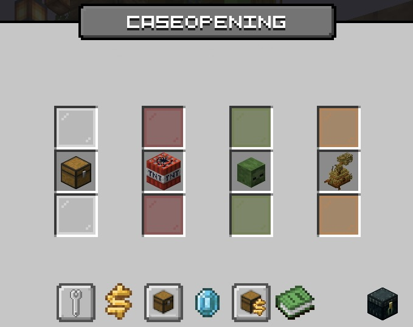

# 🎁 CaseOpening

Im Case-Opening können zufällige Gewinne gezogen werden. Es gibt verschiedene Kisten, welche verschiedene Gewinne beinhalten und über unterschiedliche Wege erhalten werden können.

<figure><figcaption>
CaseOpening am Spawn
</figcaption></figure> <figure><figcaption>
Kisten-Übersicht
</figcaption></figure>

Das Case-Opening lässt sich an allen Spawns durch Blöcke mit Partikeln erkennen und durch einen Rechtsklick auf den Block öffnen. Aus dem CaseOpening können zusätzlich eigene CaseOpening-Blöcke gewonnen werden, welche man auf dem eigenen Grundstück platzieren und dort nutzen kann.


Solltest du beim Öffnen einer Kiste aus Versehen die Region wechseln oder den Server verlassen, ist dein Gewinn nicht verloren.

Kann der Gewinn auch offline zugestellt werden (z.B. Rechte oder Geld), wird er dir auch in deiner Abwesenheit gutgeschrieben. Kann der Gewinn **nicht** offline zugestellt werden (z.B. Items), wird der Gewinn in die offenen Gewinne gelegt (Endertruhe unter „Meine Kisten“).


## In-Game Store

Über den **In-Game Store** könnt ihr **Kristalle und Kisten direkt im Spiel kaufen**, ohne dafür den Webshop öffnen zu müssen. Dabei könnt ihr genau die Menge kaufen, die ihr benötigt.

1. Verknüpft einmalig ein **Zahlungsmittel über Stripe**.
2. Wählt im In-Game Store die gewünschten Kristalle oder Kisten aus.
3. Bestätigt den Kauf.
4. Der im Shop angezeigte Betrag wird anschließend über das hinterlegte Zahlungsmittel abgebucht.


Ein Tutorial, welches zur Einführung des In-Game Stores erstellt wurde, findet ihr hier: [https://www.youtube.com/watch?v=GbdzHlwIcuY](https://www.youtube.com/watch?v=GbdzHlwIcuY). Bitte beachtet, dass die im Video genannte Aktion zur Verknüpfung beendet ist.


**Wichtig:** Eine Abbuchung erfolgt **nur nach eurer Bestätigung** des jeweiligen Kaufs.

Die Verknüpfung eures Zahlungsmittels könnt ihr jederzeit wieder entfernen. Nutzt dafür **`/stripe`** oder die **Einstellungen des CaseOpenings**.

### Prestige-Tokens

Durch Käufe von **Kristallen oder Kisten mit Echtgeld im In-Game Store** erhaltet ihr **Prestige-Tokens**. Diese könnt ihr im Prestige-Shop für besondere Vorteile und Angebote einlösen.\
Den Prestige-Shop findet ihr am Spawn.

<figure><figcaption></figcaption></figure>

Im Prestige-Shop findet ihr unter anderem:

* Kristallpakete
* den **Enderman-Farbverlauf**


**Wichtig:** Prestige-Tokens erhaltet ihr nur durch **Echtgeldkäufe von Kristallen oder Kisten über den In-Game Store**. Sie sind nicht einfach eine allgemeine Ingame-Währung.


Die Anzahl der erhaltenen Prestige-Tokens richtet sich nach euren Käufen im In-Game Store.

## Kisten-Arten

### Die Vote-Kiste 

Die Vote-Kiste ist die kleinste Standard-Kiste und enthält neben einigen wertvollen Gewinnen auch Items aus dem Alltagsbedarf. Du erhältst Vote-Kisten für das aktive Nutzen des Vote-Systems (`/vote`). Du kannst pro Tag eine Kiste erhalten, mit dem Öffnen aber auch warten, bis du mehrere angesammelt hast.

### Die Köpfe-Kiste .png>)

In der Köpfe-Kiste gibt es eine Vielzahl von thematisch zusammengehörenden Köpfen. Die Kiste wird regelmäßig vom Team angepasst: Die Auswahl der Köpfe sowie die Themen der Sets werden in regelmäßigen Abständen geändert.

Die Köpfe-Kiste kann ab dem [**Griefer-Rang**](../grundbefehle/range/griefer-rang.md) mit dem Befehl `/freekiste` erhalten werden oder über Kristalle gekauft werden.

### Die MiniGame-Kiste .png>)

Die MiniGame-Kiste kann nicht gekauft werden, sondern nur durch einen Sieg in einer öffentlichen Lobby der MiniGames gewonnen werden. Dabei hat jeder Spieler eine Abklingzeit und die Kiste wird nicht bei jedem Sieg vergeben. Prüfe also nach einem Sieg einer öffentlichen MiniGame-Lobby, ob du eine Kiste erhalten hast.

### Die Platin-Kiste .png>)

Die Platin-Kiste ist die Standardkiste in der Cloud. Diese kann ausschließlich über Kristalle oder als Gewinn einer anderen Kiste erhalten werden.

Hier findest du neue Feature-Gegenstände, Funktions-Items und vieles mehr.

### Die saisonalen Kisten .png>) .png>) .png>) .png>)

Saisonale Kisten sind zeitlich begrenzt und üblicherweise zu bestimmten Jahreszeiten oder Feiertagen verfügbar. Sie können nur in dieser Zeit gekauft werden. Das sind in der Regel die Winter-Kiste, die Frühlings-Kiste, die Sommer-Kiste und die (goldene) Herbst-Kiste.

Hier befinden sich in der Regel die wertvollsten Gewinne in der Kiste, wie zum Beispiel spezielle Sammler-Items.

## Der Angebotszug

Der Angebotszug ist dein persönlicher Rabatt-Händler für alle Kistensorten.

Der Händler bringt wöchentlich 10 exklusive Angebote mit, die nur du hast.

Jede Woche am Montag um 0:00 Uhr setzt sich der Zug zurück und ihr bekommt ganz neue Angebote.

Den Angebotszug könnt ihr am Spawn direkt neben dem CaseOpening finden. Dort könnt ihr zunächst nur das erste Angebot kaufen, die restlichen erst danach in der gezeigten Reihenfolge.
