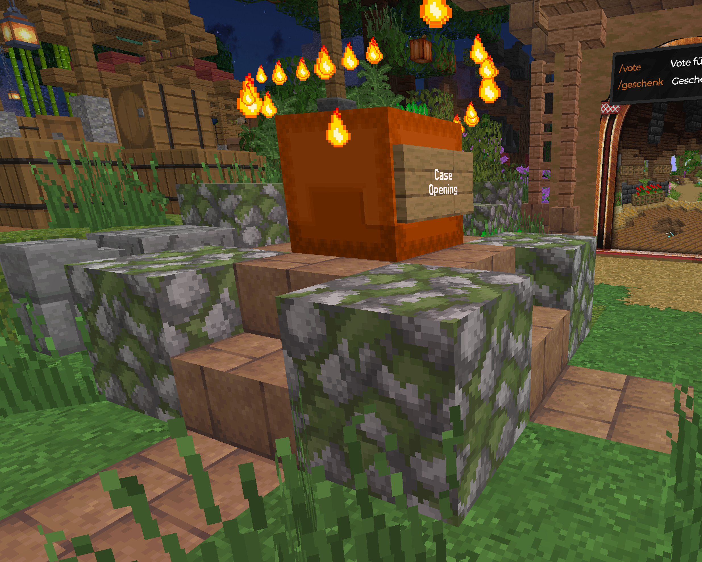

# Case Opening

Im Case Opening können zufällige Gewinne gezogen werden. Es gibt verschiedene Kisten, welche verschiedene Gewinne beinhalten und über unterschiedliche Wege erhalten werden können.

<figure><figcaption>
Case Opening am Spawn
</figcaption></figure>

 

<figure><figcaption>
Kistenübersicht
</figcaption></figure>

### Der Case Opening Block

Das Case Opening lässt sich an allen Spawns durch folgende Blöcke mit Partikeln erkennen und durch einen Rechtsklick auf den Block öffnen. Aus dem Case Opening können zusätzlich eigene Case Opening Blöcke gewonnen werden, welche auf dem eigenen Grundstück platziert werden können.

## Die verschiedenen Kisten

### Die Vote-Kiste

Die Vote-Kiste kann durch das tägliche voten für GrieferGames erhalten werden. Um zu Voten, kannst du dir den Link per `/vote` abrufen und nach dem Voten deine Vote-Kiste mit `/geschenk` abholen.

### Die Köpfe-Kiste

Die Köpfe-Kiste enthält monatlich wechselnde Köpfesets, welche meist einen verzauberten Kopf als besonderen Gewinn beinhalten.

Die Köpfe-Kiste kann ab dem Griefer-Rang mit dem Befehl `/freekiste` erhalten werden oder über Kristalle gekauft werden.

### Die Minigame-Kiste

Die Minigame-Kiste kann nicht gekauft werden, sondern nur durch das Gewinnen einer öffentlichen Lobby in den Minigames gewonnen werden. Dabei hat jeder Spieler einen Cooldown und die Kiste wird nicht bei jedem Sieg vergeben. Prüfe also nach einem Sieg in einer öffentlichen Minigame-Lobby, ob du eine Kiste erhalten hast.

### Die Platin-Kiste

Die Platin-Kiste ist die Standardkiste in der Cloud. Diese kann ausschließlich über Kristalle oder als Gewinn einer anderen Kiste erhalten werden.

Hier findest du neue Feature-Gegenstände, Funktionsitems und vieles mehr..

### Die Season-Kiste


Aktuell ist dieses die **Sommer-Kiste**


Die Kiste der Season wird bei z.B. Jahreszeiten-Wechsel oder besonderen Zeiten im Jahr komplett getauscht. Während der Season wird die Kiste ebenfalls aktualisiert, kann aber nach Beginn einer neuen Season nicht mehr gekauft werden.

Hier befinden sich in der Regel die wertvollsten Gewinne in der Kiste, wie z.B. spezielle Sammelitems.

## Benutzung des Case Openings

### Case-Opening Inventar

Das Case-Opening Inventar listet unter dem Titel die einzelnen Kisten-Typen auf:

Durch das Hovern über eine der Kisten kannst du ablesen, wie viele Kisten du von dieser Sorte besitzst:

.png>)

Durch einen **Rechtsklick** auf einen Kistentyp öffnet man diese Kiste.\
Durch einen **Linksklick** auf einen Kistentyp kann man sich den Kisteninhalt ansehen.

### Kristall-Guthaben ansehen

Um die Anzahl an Kristallen, die in deinem Besitz sind, anzuzeigen musst du mit deiner Maus über den blauen Kristall in der Mitte des Menüs fahren, um folgenden Hinweis zu sehen:

<figure><figcaption></figcaption></figure>

### Kisten-Besitz ansehen

Um die Anzahl an Kisten, die in deinem Besitz sind anzuzeigen, musst du das Menü `Meine Kisten` durch klicken auf das Symbol links neben dem Kristall öffnen:

Hier siehst du auch deine bereits gekauften Kisten, deren Typ nicht mehr im Hauptmenü des Case-Openings zu sehen ist.

Durch einen Klick auf das Endertruhen-Symbol kannst du deine offenen Gewinne abholen.

### Ingame Kauf von Kisten über Kristalle


Bei einem **gleichzeitigem** Kauf von einer größeren Anzahl an Kisten gibt es einen Mengenrabatt.


Um Kisten zu Kaufen musst du das Menü `Kisten Kaufen` durch einen Klick auf die Kiste mit einem Dollar-Zeichen rechts neben dem Kristall öffnen:

.png>)

Hier kann man auswählen, welche Kiste man kaufen möchte. Am Ende muss der Kauf noch einmal bestätigt werden.


Dieser Kauf kann nicht rückgängig gemacht werden!


### Keinen Gewinn erhalten? Gekickt oder Region gewechselt?

Solltest du beim Öffnen einer Kiste ausversehen die Region wechseln oder den Server verlassen, ist dein Gewinn nicht verloren.&#x20;

* Kann der Gewinn auch offline zugestellt werden (wie z.B. Rechte oder Geld), werden diese auch in deiner Abwesenheit dir gutgeschrieben.
* Kann der Gewinn nicht offline zugestellt werden (wie z.B. Items), werden die Gewinne in die offenen Gewinne gelegt (Endertruhe unter Meine Kisten). Dort kannst du diese dann abholen.
