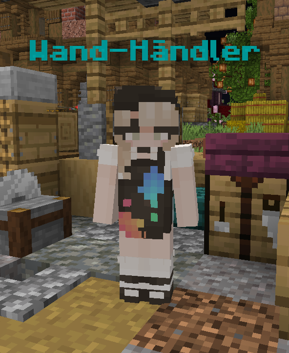
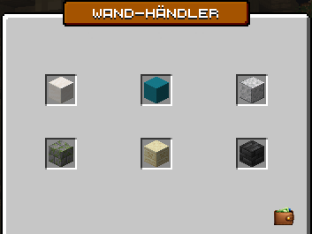
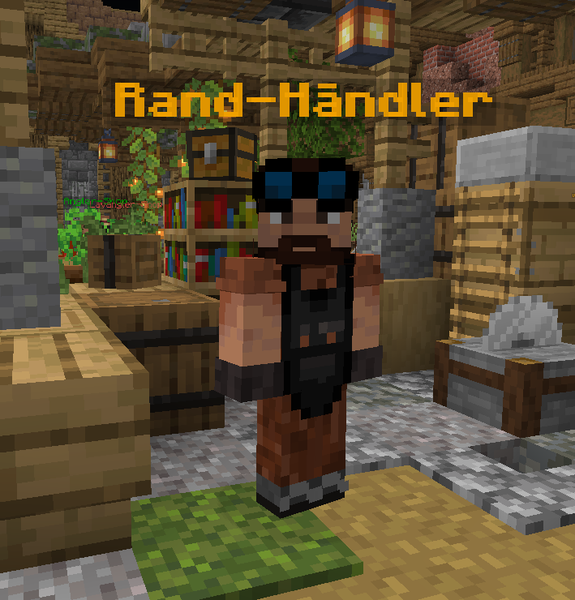
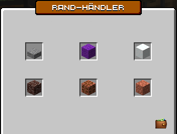
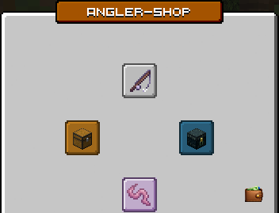
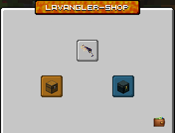

# 💰 Händler

Am Spawn des Servers befinden sich einige NPCs, darunter auch Händler, die verschiedene Waren für unterschiedliche Währungen verkaufen.

 (2).png>)

## Das Daily-Shop-System

Alle Händler am Spawn bieten ihre Angebote nach einem Daily-Shop-Prinzip an. Die Händler besitzen mehrere Angebots-Slots, von denen jeder einen eigenen Angebots-Pool hat. Aus diesem Pool wird zufällig, abhängig von der Seltenheit des Angebots, ein Angebot ausgewählt. Die Slots wechseln in der Regel alle 24 Stunden.

Wann ein bestimmtes Angebot das nächste Mal verfügbar ist, lässt sich daher kaum vorhersagen. Nutze also die Chance, wenn dein gewünschtes Item verfügbar ist.

## Freie Kaufslots

In freien Kaufslots rotieren die Items nicht wie im Daily-Shop, sondern es sind jederzeit alle Items kaufbar.

Beim Klick auf einen solchen Slot wird nicht direkt gekauft, sondern es öffnet sich die Ansicht des Angebots. Dort kannst du jedes Item mit einem Klick darauf kaufen.

## Amin-Shop

Beim Amin-Shop (Adventure-Händler) sind Items für Adventure Coins kaufbar. Diese erhältst du durch das Erledigen von [Adventure-Aufgaben](adventure-system.md).

<figure><figcaption>
Amin-Shop (Adventure-Händler)
</figcaption></figure>

## Wand-Händler

Beim **Wand-Händler** am Spawn kannst du verschiedene Grundstückswände kaufen. Diese verändern das Aussehen der Blöcke, die die Wand deines Grundstücks bilden.

<figure><figcaption>
Wand-Händler NPC
</figcaption></figure>

Bei den Angeboten handelt es sich um einen **Daily-Shop**, weshalb die verfügbaren Wände täglich gewechselt werden. Im ersten Slot des Wand-Händlers befindet sich immer die Standard-Wand. Alle anderen Slots sind spezielle Variationen.


Wand-Effekte kann man nur auf seinem eigenen Grundstück nutzen.

Wenn man das Item mit Rechtsklick nutzt, kann man zwischen einer temporären Vorschau ohne Nutzung oder der direkten Nutzung entscheiden.


Möchtest du wieder die normale Grundstückswand verwenden, kannst du jederzeit die **Standard-Wand** aus dem ersten Slot auswählen.

## Rand-Händler

Beim **Rand-Händler** am Spawn kannst du verschiedene Grundstücksränder kaufen. Diese verändern das Aussehen der Blöcke, die den Rand deines Grundstücks bilden.

<figure><figcaption>
Rand-Händler NPC
</figcaption></figure>

Bei den Angeboten handelt es sich um einen **Daily-Shop**, weshalb die verfügbaren Ränder täglich gewechselt werden. Im ersten Slot des Rand-Händlers befindet sich immer der Standard-Rand. Alle anderen Slots sind spezielle Variationen.


Rand-Effekte kann man nur auf seinem eigenen Grundstück nutzen.

Wenn man das Item mit Rechtsklick nutzt, kann man zwischen einer temporären Vorschau ohne Nutzung oder der direkten Nutzung entscheiden.


Alternativ kann ein **Streamer mit deiner Erlaubnis** einen individuellen Streamer-Rand auf deinem Grundstück bauen.

Möchtest du wieder den normalen Grundstücksrand verwenden, kannst du jederzeit den **Standard-Rand** aus dem ersten Slot auswählen.

## Angler-Shop / Lavangler-Shop

Beim Angler-Shop-NPC kannst du die **ICTUS aqua 3000** Angel für 20 [Adventure Coins](adventure-system.md) kaufen. Diese wird für Angel-Events benötigt, um besondere Items angeln zu können.

Außerdem kannst du beim Angler-Shop-NPC Köder für [Adventure Coins](../waehrungen/) kaufen, die nötig sind, um das neue [Angel-System](angel-system.md) zu nutzen.

Beim Lavangler-Shop-NPC kannst du die **IGNIS esca 6666** Angel für 20 [Adventure Coins](adventure-system.md) kaufen. Diese wird für Lava-Angel-Events benötigt, um besondere Items angeln zu können.

<figure><figcaption>
Lavangler-Shop
</figcaption></figure>

### Dauerhafte Belohnungen

Über die Kiste auf der linken Seite im Angler- oder Lavangler-Shop kann man sich die **dauerhaften Belohnungen** ansehen.

Diese Belohnungen können auch außerhalb von Angel-Events mit der jeweiligen Angel geangelt werden. Dazu gehören teilweise auch Items aus vergangenen Angel-Events, beispielsweise **Angelkarten oder Köpfe**.

### Event-Items

Unter der Enderkiste auf der rechten Seite werden die **Event-Items des aktuellen Angel-Events** angezeigt. Die dort angezeigten Items bleiben auch nach dem Ende des Events sichtbar. Anhand dieser Anzeige kann man daher nicht erkennen, ob aktuell ein Angel-Event stattfindet.


Ob gerade ein Angel-Event läuft, sollte man deshalb im **Discord** überprüfen. Dort werden zu jedem Event News veröffentlicht.


## Fisch-Händler

Beim Fisch-Händler kannst du deine geangelten Fische des [Angel-Systems](angel-system.md) verkaufen und die Statistiken des Angel-Systems einsehen.

.png>)

Mehr dazu findest du auf der Seite des [Angel-Systems](angel-system.md).
