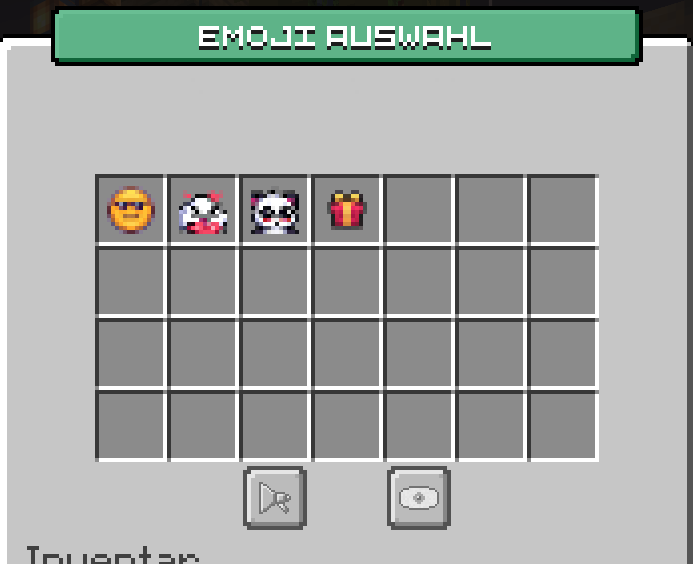
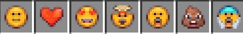
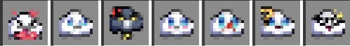
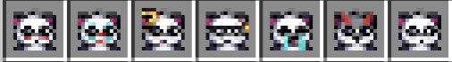
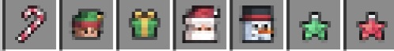

# 🤣 Emojis

Mit Emojis kannst du den Chat bunt gestalten und deine Gefühle Ausdrücken

## So machst du es

 Unter dem Befehl `/emoji` legst du dein Standardpack fest – das wird automatisch genutzt, wenn du Emojis wie :smile: im Chat eingibst. Natürlich kannst du auch den vollen Code wie `:standard_smile:` nutzen! 
 Zusätzlich könnt ihr auch die `:-Commands` tabben.

## Diese Emoji Packete gibt es

* ### Standart Pack

* ### Cloud Pack

* ### Panda Pack

* ### Weihnachts Pack
