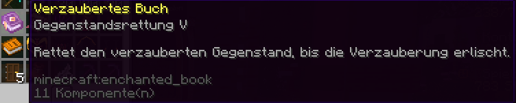

# ⬆️ Perks

Mit Perks hast du die Möglichkeit, Effekte und kleine Funktionen für dich zu aktivieren, die dich beim Spielen unterstützen.

Um das Hauptmenü zu öffnen, gib `/perks` ein oder öffne das Perks-Menü über das Hilfemenü `/?`.

## Die Perks

Im Hauptmenü findest du eine Übersicht über die existierenden Perks. Wenn du mit der Maus über ein Perk fährst, werden dir die Informationen zum Perk, die verbleibende Laufzeit und der aktuelle Status (aktiviert oder deaktiviert) angezeigt.

<figure><figcaption>
Perk-Beschreibung (Plot-Fliegen)
</figcaption></figure>

Zu den Perks gehören unter anderem:

| Perk                | Wirkung                                                                                                                                                                     |
| ------------------- | --------------------------------------------------------------------------------------------------------------------------------------------------------------------------- |
| Plot-Fliegen        | Fliegen auf deinen eigenen Grundstücken und auf Grundstücken, auf denen du vertraut bist. Auf Grundstücken mit [Fly+ Flag](../grundstuecke/flags-setzen/fly+-flag.md) ebenfalls. |
| Kein Fallschaden    | Du bekommst keinen Fallschaden mehr.                                                                                                                                        |
| Kein Hunger         | Du bekommst keinen Hunger mehr.                                                                                                                                             |
| Geschwindigkeit     | Du bist schneller auf dem Server unterwegs.                                                                                                                                 |
| Gunst des Delfins   | Du kannst im Wasser schneller schwimmen.                                                                                                                                    |
| Keep XP             | Du behältst deine XP und Level, wenn du stirbst.                                                                                                                            |
| Keep Inventory      | Du behältst dein Inventar beim Tod.                                                                                                                                         |
| Telekinese          | Gegenstände werden beim Abbauen und Töten automatisch eingesammelt.                                                                                                         |
| Shulker-Anzeige     | Du kannst Shulker-Kisten aus dem Inventar heraus öffnen, ohne sie zu platzieren (siehe unten).                                                                              |
| Schneller abbauen   | Du erhältst einen Abbau-Boost.                                                                                                                                              |
| Leuchten            | Du erhältst den Leuchten-Effekt.                                                                                                                                            |
| Mehr Herzen         | Du erhältst mehr Herzen.                                                                                                                                                    |
| Kein Elytra-Schaden | Du erhältst keinen Schaden, wenn du mit der Elytra gegen einen Block fliegst.                                                                                               |
| Nachtsicht          | Du erhältst den Nachtsicht-Effekt.                                                                                                                                          |
| Feuerresistenz      | Du bist in Feuer und Lava durch Feuerresistenz besser geschützt.                                                                                                            |

### Perks einlösen / erhalten

Die Perks können über einlösbare Items erhalten und verlängert werden.

<figure><figcaption>
Beispiel: Item 14-Tage Plot-Fliegen
</figcaption></figure>

Die Items gibt es je nach Perk mit verschiedenen Laufzeiten und an unterschiedlichen Stellen auf der Cloud, z. B. im [Case-Opening](case-opening.md), im [Adventure-Shop](die-handler.md#amin-shop) oder als [Belohnung für Erfolge](erfolge-advancements.md).


Die Tage können nacheinander eingelöst werden und erhöhen die Gesamtlaufzeit des Perks. Es gibt hierbei keine Obergrenze der verfügbaren Tage.



Löst du ein Perk ein, das du noch nicht besessen hast oder das bereits abgelaufen war, wird es **nicht automatisch aktiviert**.


### Perks aktivieren / deaktivieren

Um ein Perk zu aktivieren oder zu deaktivieren, klicke im Perk-Menü `/perks` auf das gewünschte Perk. Das Perk zeigt seinen Status in der Item-Beschreibung (Lore) an. Zudem wird ein aktiviertes Perk im Menü verzaubert dargestellt.

### Laufzeitberechnung

Die Perks laufen immer pro Kalendertag der Aktivierung.

An jedem Tag, an dem du das Perk aktivierst oder dich mit aktiviertem Perk einloggst, wird ein Tag abgezogen. Das Perk läuft dann bis zum Ende des Kalendertages. Ein Perk wird also nur „berechnet“, wenn du es nutzt bzw. online bist.


Aktivierst du ein Perk also nachts um 23 Uhr, beträgt die Laufzeit für diesen Tag nur noch eine Stunde. Bei einem Login nach 0 Uhr wird ein weiterer Tag abgezogen.


Am letzten Tag der Laufzeit erhältst du beim Einloggen einen Hinweis im Chat. Ist die Laufzeit abgelaufen, wird das Perk automatisch deaktiviert.

## Shulker-Anzeige benutzen

Mit aktiver **Shulker-Anzeige** öffnest du eine Shulker-Kiste mit einem Rechtsklick auf die Kiste in deinem Inventar. Öffnest du dafür nur dein eigenes Inventar, kannst du den Inhalt direkt bearbeiten.

Hast du gerade eine Truhe oder ein anderes Menü geöffnet, kannst du den Inhalt der Shulker-Kiste nur ansehen.

## Einstellungen Shulker-View + Litematica


Litematica führt Aktionen aus, die ein Spieler normalerweise nicht ausführen kann, und das in sehr großer Zahl. Ohne die folgende Einstellung können dadurch Shulker-Kisten durch einen Schutzmechanismus verloren gehen.


Damit Shulker-Kisten beim Öffnen mit aktivem Litematica nicht vom Schutz entfernt werden, musst du in Litematica eine Vorkehrung treffen.

In Litematica muss ein Slot im Menü deaktiviert werden. Das ist aktuell nur bei den **Hotbar-Slots** möglich, weshalb dort ein Slot gewählt werden muss. Nachdem der Slot für Litematica deaktiviert wurde, muss dieser Slot immer für das Öffnen der Shulker-Kisten verwendet werden.

### Wie deaktiviere ich Litematica-Slots?

1. Gehe im Litematica-Menü auf **Configuration menu**.

   <figure><figcaption></figcaption></figure>
2. Wähle den Reiter **Generic**.
3. Entferne in der Einstellung `pickBlockableSlots` einen Slot deiner Wahl.


Wir empfehlen, **Slot 9** zu wählen – das ist der letzte Slot in deiner Hotbar.


<figure><figcaption></figcaption></figure>
