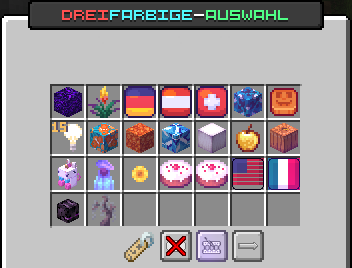
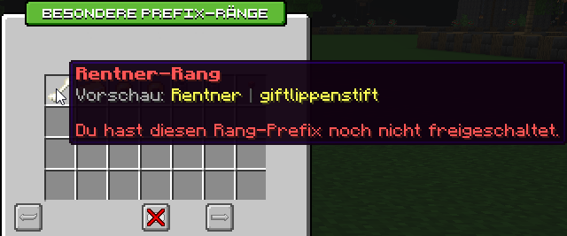
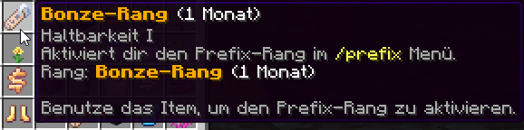

# 🖌️ Prefixe

Mit Prefixen hat jeder Spieler die Möglichkeit, seinen Namen in der Tabliste und im Chat anzupassen und ihm einen neuen Look zu verpassen.

## Prefix ändern

Mit dem Befehl `/prefix` kann das Prefix-Menü geöffnet werden, welches die möglichen Prefixe auf der Cloud anzeigt.

<figure><figcaption>
Übersicht der dreifarbigen Prefixe
</figcaption></figure>

Jeder Prefix, den du besitzt, wird verzaubert dargestellt. Mit einem Klick auf den Prefix kannst du ihn aktivieren und wenige Sekunden später ändert sich der Prefix in der Tabliste.


Um deinen Rang-Prefix zurückzuerhalten, kannst du den Prefix mit einem Klick auf  **Prefix zurücksetzen** zurücksetzen.


Mit den Buttons  und  kann zwischen den verschiedenen Prefix-Seiten gewechselt werden. Die folgenden Prefix-Seiten und -Arten sind aktuell verfügbar:

* **Dreifarbige Prefixe**\
  Erzeugen einen Verlauf zwischen drei verschiedenen Farben.
* **Verlaufs-Prefixe**\
  Erzeugen einen Verlauf zwischen zwei verschiedenen Farben.
* **Zweifarbige Prefixe**\
  Färben Rang und Name in zwei verschiedenen Farben.
* **Einzelfarben-Prefixe**\
  Ändern die Farbe des Namens in eine einzelne Farbe.
* **Rang-Prefixe**\
  Rang-Farben der niedrigeren Ränge (Beispiel: für Ultra → Premium, für Legende → Ultra & Premium).

## Prefixe erhalten

Prefixe gibt es über verschiedene Systeme auf der Cloud. Sie können in verschiedenen Kisten des [Case-Openings](case-opening.md), beim [Adventure-Händler](die-handler.md#amin-shop) oder auch durch [Erfolge](erfolge-advancements.md) erhalten werden.

## Prefix-Invertierer für Verlaufs-Prefixe

Im Case-Opening gibt es den  **Prefix-Invertierer**. Dieser bietet die Möglichkeit, einen vorhandenen Farbverlauf als umgekehrten bzw. invertierten Verlauf freizuschalten.

<figure><figcaption>
Item-Beschreibung Prefix-Invertierer
</figcaption></figure>

Um einen Prefix-Invertierer zu verwenden, klicke im `/prefix`-Menü auf den gewünschten Farbverlauf. Dann öffnet sich das Invertierer-Menü, mit dem du zwischen den beiden Verlaufsrichtungen wählen kannst.

<figure><figcaption>
Invertierer-Menü (Blauer Farbverlauf)
</figcaption></figure>

Mit einem Klick auf den rechten Slot kannst du den invertierten Prefix verwenden. Ist er noch nicht freigeschaltet, wird er mit dem Prefix-Invertierer aus deinem Inventar freigeschaltet.

<figure><figcaption>
Anzeige invertierter Verlauf (freigeschaltet)
</figcaption></figure>


Um einen Prefix invertieren zu können, musst du den Prefix besitzen!



Es können nicht alle Prefixe mit dem Invertierer invertiert werden. In der Regel stehen die Farbverläufe zur Verfügung, jedoch nicht die speziellen Prefixe wie Sommer-, Herbst- oder Event-Farbverläufe. Prüfe vorher, ob der gewünschte Prefix ein Invertierungsmenü öffnet.


## Prefix-Animationen

Prefix-Animationen ändern die Darstellung deines Prefixes in der Tabliste. Die Animation kann dabei unterschiedlich sein (Farbwechsel, Änderungen der Zeichen etc.).

Folgende Animationen stehen aktuell zur Verfügung:

* **Verlaufsanimation**\
  Lässt einen Verlaufs-Prefix hin und her laufen.
* **Pulsierende Verlaufsanimation**\
  Lässt einen Verlaufs-Prefix zwischen den Farben pulsieren.


Achtung: Die Prefixanimationen werden durch das [Ressourcenpaket](../ressourcenpaket.md) ermöglicht. Hast du dieses nicht aktiviert, siehst du keine Prefixanimationen.


## Prefix-Ränge

Mit einem **Prefix-Rang** kannst du deinen Namen im Chat verändern. Der Prefix wird vor deinem Spielernamen angezeigt. Über den Befehl `/prefix` kommst du in das bekannte Prefix-Menü. Klickst du dort unten links auf das Namensschild, gelangst du in das Menü für die Prefix-Ränge.

<figure><figcaption></figcaption></figure>


Der Prefix-Rang ist ein rein kosmetischer "Rang", welcher keinen Einfluss auf die gekauften Ränge und die dazugehörigen Rechte hat. Aktuell gibt es unter anderem folgende Custom-Prefixe: Rentner, Bonze, Prinzessin, Prinz, GOAT, Laubbläser und Flash.


Prefix-Ränge können in verschiedenen Kisten des [Case-Openings](case-opening.md) erhalten werden. Die Dauer des jeweiligen Ranges findest du in der Beschreibung des Items.

<figure><figcaption></figcaption></figure>
