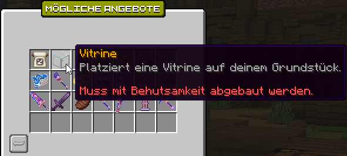

# 💎 Showcase, Truhen & Vitrinen

Vitrinen und Showcases ermöglichen es dir, Items sicher und dekorativ auf deinem Plot darzustellen, perfekt für Shops, Sammlungen oder besondere Items.

## Showcase-Truhen

Die Showcase-Truhe ist ein Behältnis, das von anderen geöffnet werden kann, in dem aber weder Items hinzugefügt noch entnommen werden können.

Diese können zwar durch Freigabe des entsprechenden Materials oder durch vertrauen des Spielers von anderen Spielern geöffnet werden, jedoch kann nur der Grundstücksbesitzer Items dort hineinlegen oder entnehmen.&#x20;

Damit andere Spieler den Inhalt der Kiste einsehen aber nicht ändern können, muss die Use-Flag für den entsprechenden Behälter gesetzt werden. Das wird durch folgenden Befehl ermöglicht: `/p flag set use <Item-Name>`.  Für Redstone-Truhen wäre der Befehl also `/p flag set use trapped_chest` .


Die Flag gilt für **alle Behälter dieses Typs auf dem Grundstück**, nicht nur für den Showcase.

Wird beispielsweise eine **Redstone-Truhe** mit der Flag **trapped\_chest** als Showcase verwendet, können Spieler auch auf andere Redstone-Truhen zugreifen.

Daher sollte man diesen Behältertyp **nicht für das eigene Lager verwenden**.


## Vitrinen

Mit einer **Vitrine** können Items auf dem Grundstück ausgestellt werden. Das Item wird dabei lediglich **angezeigt bzw. gespiegelt** und nicht aus dem Inventar entfernt.

Die Vitrine ist unter anderem im **Amin-Shop** im Tausch gegen **Adventure-Coins** erhältlich.

<figure><figcaption></figcaption></figure>


Eine **Vitrine** kann mit einer Spitzhacke mit **Behutsamkeit** abgebaut werden. Dabei bleibt die Vitrine als Item erhalten und kann anschließend erneut platziert werden.

