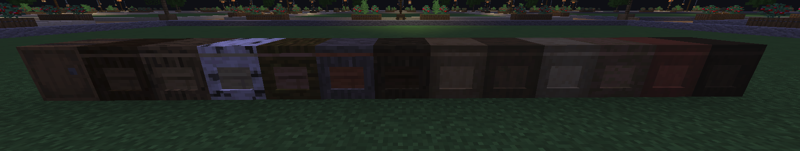
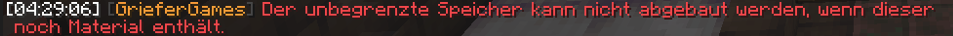

# Unbegrenzter Speicher

Im Cloud Netzwerk wurden **Unbegrenzte Speicher** eingeführt, um eine Alternative für die auf dem 1.8-Netzwerk verfügbaren Möglichkeit der Komprimierung zu bieten.

 (1).png>)

### Funktion 

In einem unbegrenzten Speicher können bis zu **2.147.483.647 Einheiten** eines Items gelagert werden. Hierbei kann pro Speicher nur **ein vorher definiertes Item** (siehe “Herstellung”) gelagert werden.&#x20;

Eine Verwendung mit Trichtern ist normal möglich. Hierbei werden die ersten 26 Slots normal befüllt. Der letzte Slot bleibt hierbei frei. Dort abgelegte Items werden in das zusätzliche Lager gelegt.&#x20;

Die Menge wird im Titel unter “Storage:” angezeigt. Diese aktualisiert sich erst, wenn das Lager ein weiteres Mal geöffnet wird. Die Darstellung erfolgt ab 10.000 Items in auf volle tausend Items abgerundeten Beträgen. Items aus dem zusätzlichen Lager können per Trichter entnommen werden, oder rutschen in das verfügbare Interface nach, sobald man Items aus dem Lager “shiftet”, oder dieses aktualisiert, indem man ein Item aus seiner Hand in das Lager legt.

<figure><figcaption></figcaption></figure>

<figure><figcaption></figcaption></figure>


<mark style="color:orange;">**Achtung:**</mark> Der unbegrenzte Speicher verhält sich zunächst wie ein normales Fass. So können grundsätzlich auch Items in die verfügbaren Slots gelegt werden, für die der zusätzliche Speicher nicht geeignet ist. Befindet sich auf einem der Slots ein nicht kompatibles Item, steht die Funktion des zusätzlichen Speichers nicht zur Verfügung.



<mark style="color:red;">**Warnung:**</mark> Werden Items mit zusätzlichen Eigenschaften (Signierungen, Verzauberungen, o.ä.) in den zusätzlichen Speicher gelegt, verlieren diese Ihre Eigenschaft.


### Herstellung 

Das Rezept zur Herstellung eines unbegrenzten Speichers benötigt 4 Truhen, 2 Netheritbarren, 1 Enderauge, 1 Fass (oder CustomBlock Kiste - siehe “Aussehen”) und das zu lagernde Item.

<figure><figcaption>
Crafting-Rezept
</figcaption></figure>


Der Gegenstand oben in der Mitte bestimmt den zu lagernden Gegenstand.


### Aussehen 

Die Herstellung des unbegrenzten Speichers ist mit den [CustomBlock](../customblocks.md) Kisten möglich. Dies ermöglicht zum Beispiel eine abwechslungsreiche Dekoration von Lagersystemen. Für Spieler, die keine [CustomBlocks](../customblocks.md) nutzen, werden die unbegrenzten Speicher als Fässer dargestellt.


Stellt ihr den unbegrenzten Speicher mit Kisten der [CustomBlocks](../customblocks.md) her, dann könnt ihr diese auch separat mit der Use-Flag freigeben.


### Verfügbare Items 

Unbegrenzte Speicher können grundsätzlich für alle stackbaren Items erstellt werden. Dadurch stehen zum Beispiel Speicher für Betten, Boote, Shulker, Werkzeuge, Waffen, Rüstungen, Lava-/Wassereimer, verzauberte Bücher, Tränke, Schallplatten und weitere nicht zur Verfügung.

#### Ausnahmen 

Obwohl es sich um stackbare Items handelt, stehen weitere Items nicht zur Verfügung, wie zum Beispiel für Treppen, Stufen, Türen, Knöpfe, Zäune, Zauntore, Falltüren, Druckplatten und Beacons.

### Abbau 

Der Abbau oder die Zerstörung von unbegrenzten Speichern ist nur möglich, wenn keine Items im zusätzlichen Speicher liegen. Dies wird durch eine Warnung im Chat angezeigt.

### Mögliche Fehlerquellen 

#### Itemgebundener unbegrenzter Speicher 

Ist ein unbegrenzter Speicher platziert, ist nicht mehr ersichtlich für welches Item dieser hergestellt wurde. Dies kann durch Abbau herausgefunden werden. Liegen Items in dem zusätzlichen Speicher kann davon ausgegangen werden, dass der unbegrenzte Speicher für das Item hergestellt wurde, welches sich in den sichtbaren Slots des Speichers befindet.

#### Spielsteine 

Spielsteine werden von Trichter-Filtern u.ä. als das ursprüngliche Item erkannt. Diese werden aber in den letzten Slot des unbegrenzten Speichers und nicht in den zusätzlichen eingelagert und blockieren somit die weitere Funktion.

#### Verzauberte Items 

Die Einlagerung mit Trichtern von verzauberten Items wird blockiert. Dies kann ggf. dazu führen, dass der Slot des Trichters blockiert wird.

#### Freigabe (“Use”) Flags 

Werden die unbegrenzten Speicher mit Fässern (und nicht mit Custom Blocks) hergestellt, wirkt die Freigabe-Flag für normale Fässer (“use barrel”) auch für die unbegrenzten Speicher.
