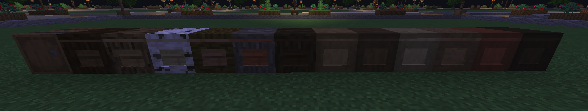
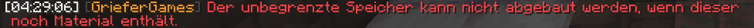

# 📦 Unbegrenzter Speicher

Auf dem Cloud-Netzwerk wurden **Unbegrenzte Speicher** eingeführt, um eine Alternative zu den Komprimierungsmöglichkeiten des 1.8-Netzwerks zu bieten.

 (1).png>)

## Funktion

In einem unbegrenzten Speicher können bis zu **2.147.483.647 Einheiten** eines Items gelagert werden. Dabei kann pro Speicher nur **ein vorher festgelegtes Item** (siehe [Herstellung](unbegrenzter-speicher.md#herstellung)) gelagert werden.

Die Verwendung mit Trichtern ist ganz normal möglich. Dabei werden die ersten 26 Slots normal befüllt, der letzte Slot bleibt frei. Items, die dort abgelegt werden, wandern in das zusätzliche Lager.

Die gelagerte Menge wird im Titel unter „Storage:“ angezeigt. Sie aktualisiert sich erst, wenn das Lager erneut geöffnet wird. Ab 10.000 Items wird die Menge in Tausend abgerundet dargestellt (z. B. „12k“), ab 10 Millionen Items in Millionen (z. B. „15m“).

Items aus dem zusätzlichen Lager können per Trichter entnommen werden. Außerdem rutschen sie in die sichtbaren Slots nach, sobald du Items per Shift-Klick aus dem Lager nimmst oder das Lager aktualisierst, indem du ein Item aus deiner Hand hineinlegst.

<figure><figcaption></figcaption></figure>

<figure><figcaption></figcaption></figure>


<mark style="color:orange;">**Achtung:**</mark> Der unbegrenzte Speicher verhält sich zunächst wie ein normales Fass. So können grundsätzlich auch Items in die sichtbaren Slots gelegt werden, für die der zusätzliche Speicher nicht vorgesehen ist. Befindet sich auf einem der Slots ein nicht kompatibles Item, steht die Funktion des zusätzlichen Speichers nicht zur Verfügung.



<mark style="color:red;">**Warnung:**</mark> Werden Items mit zusätzlichen Eigenschaften (Signierungen, Verzauberungen o. Ä.) in den zusätzlichen Speicher gelegt, verlieren diese ihre Eigenschaften.


## Herstellung

Das Rezept zur Herstellung eines unbegrenzten Speichers benötigt 4 Truhen, 2 Netheritbarren, 1 Enderauge, 1 Fass (oder CustomBlock-Kiste – siehe [Aussehen](unbegrenzter-speicher.md#aussehen)) und das zu lagernde Item.

<figure><figcaption>
Herstellungsrezept
</figcaption></figure>


Der Gegenstand oben in der Mitte bestimmt den zu lagernden Gegenstand.


## Aussehen

Die Herstellung des unbegrenzten Speichers ist mit den [CustomBlock](../../allgemein/clients-and-modifikationen/customblocks.md)-Kisten möglich. Das ermöglicht zum Beispiel eine abwechslungsreichere Gestaltung von Lagersystemen. Für Spieler, die keine [CustomBlocks](../../allgemein/clients-and-modifikationen/customblocks.md) nutzen, werden die unbegrenzten Speicher als Fässer dargestellt.


Stellst du den unbegrenzten Speicher mit Kisten der [CustomBlocks](../../allgemein/clients-and-modifikationen/customblocks.md) her, dann kannst du diese auch separat mit der Use-Flag freigeben.


## Anzeige am Speicher

Mit dem Item **Unendliches Lager - Display-Aktivierung** lässt du vor einem unbegrenzten Speicher anzeigen, welches Item darin lagert und wie viel davon. Halte das Item dazu in der Hand und klicke damit auf den Speicher.


Jeder unbegrenzte Speicher kann nur eine Anzeige haben. Die angezeigte Menge wird nicht bei jeder Änderung sofort aktualisiert.


### Ausnahmen

Folgende Items stehen nicht zur Verfügung: Leuchtfeuer, Spawner, Spawn-Eier, Shulker-Kisten und Shulker-Schalen, Bündel, Drachenei, Elytren, Knospender Amethyst, Verstärkter Tiefenschiefer, befallene Blöcke, Fässer sowie Blöcke der [CustomBlocks](../../allgemein/clients-and-modifikationen/customblocks.md).

Außerdem kann für Items, die zusätzliche Informationen benötigen (wie z. B. Tränke, getränkte Pfeile, Verzauberungsbücher, beschriebene Bücher, Karten, Ziegenhörner, Seltsame Suppe oder Eimer mit Axolotl bzw. Tropenfisch), kein unbegrenzter Speicher erstellt werden.

## Abbau

Unbegrenzte Speicher können nur abgebaut oder zerstört werden, wenn keine Items mehr im zusätzlichen Speicher liegen. Andernfalls erscheint eine Warnung im Chat.

## Mögliche Fehlerquellen

### Item-gebundener unbegrenzter Speicher

Ist ein unbegrenzter Speicher platziert, ist nicht mehr ersichtlich, für welches Item er hergestellt wurde. Das lässt sich durch Abbauen herausfinden. Liegen Items im zusätzlichen Speicher, kann davon ausgegangen werden, dass der unbegrenzte Speicher für das Item hergestellt wurde, welches sich in den sichtbaren Slots des Speichers befindet.

### Spielsteine

Spielsteine werden von Trichterfiltern und Ähnlichem als das ursprüngliche Item erkannt. Sie werden aber in den letzten Slot des unbegrenzten Speichers und nicht in den zusätzlichen Speicher eingelagert und blockieren so die weitere Funktion.

### Verzauberte Items

Das Einlagern verzauberter Items per Trichter wird blockiert. Das kann ggf. dazu führen, dass der Trichter-Slot blockiert wird.

### Beschädigte Items

Beschädigte Werkzeuge, Waffen oder Rüstungsteile werden nicht in den zusätzlichen Speicher übernommen.

### Freigabe-Flags („use“)

Werden die unbegrenzten Speicher mit Fässern (und nicht mit [CustomBlocks](../../allgemein/clients-and-modifikationen/customblocks.md)) hergestellt, wirkt die Freigabe-Flag für normale Fässer (`use barrel`) auch für die unbegrenzten Speicher.
