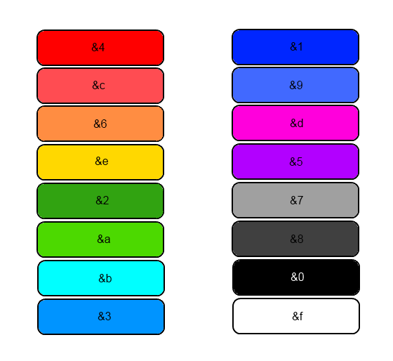

# Signieren von Items


Dieser Befehl steht dir ab dem **Titan-Rang** zur Verfügung.


* Um ein Item zu signieren, muss dieses in der Hand gehalten werden. Dann kann mit dem Befehl `/sign <Nachricht>` eine Signatur hinzugefügt werden.

<figure><figcaption>
Beispiel-Signierung eines Items
</figcaption></figure>

* Jedes Item kann immer nur eine Signatur besitzen und diese kann nur vom Besitzer mit `/unsign` wieder entfernt werden.
* Wenn du gerne färbig signieren willst, kannst du die Minecraft Farbcodes verwenden. Hierfür muss vor dem jeweiligen Wort oder Buchstaben folgendes stehen: &\<Farbcode>TEXT.&#x20;
* Um deine Signierung **fett** zu schreiben musst du lediglich nach der Farbe und vor dem Text ein **\&l** einfügen. Beispiel: &\<Farbcode>**\&l**TEXT.

<figure><figcaption></figcaption></figure>

Das Limit der Signierung beträgt 65 Zeichen, hierbei zählen aber die Farbcodes NICHT.

### Signieren mit Hexadezimal-Farben

* In der Signatur ist es ebenfalls möglich Hexadezimal-Farben zu verwenden. Diese können mit \&#\<Farbcode> _(Bespiel für Rot: \&#ff0000)_ hinzugefügt werden.
* Pass aber auf, dass die allgemeine Länge im Chat 256 Zeichen beträgt, somit kann die Signierung inklusive Farbcodes nicht länger sein.


Möchte man Hexadezimal-Farben in Fett schreiben, muss vor jeder Farbe die Formatierung mit \&r zurückgesetzt werden.

