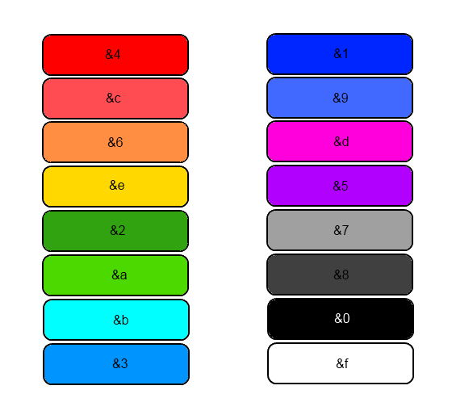

# Signieren von Items


Dieser Befehl steht dir ab dem [**Titan-Rang**](range/titan-rang.md) zur Verfügung.


## Item signieren

Um ein Item zu signieren, halte es in der Hand und füge mit dem Befehl `/sign <Nachricht>` eine Signatur hinzu.

<figure><figcaption>
Beispiel-Signierung eines Items
</figcaption></figure>

* Jedes Item kann immer nur eine Signatur besitzen. Diese kann nur der Spieler, der sie gesetzt hat, mit `/unsign` wieder entfernen.
* Das Limit der Signierung beträgt 65 Zeichen, Farbcodes zählen dabei **nicht** mit.

### Farbig und fett signieren

* Wenn du farbig signieren möchtest, kannst du die Minecraft-Farbcodes verwenden. Setze dafür vor das jeweilige Wort oder den Buchstaben den Farbcode: `&<Farbcode>TEXT`.
* Um deine Signierung **fett** zu schreiben, füge nach der Farbe und vor dem Text ein `&l` ein. Beispiel: `&<Farbcode>&lTEXT`.

<figure><figcaption></figcaption></figure>

## Signieren mit Hexadezimal-Farben

* In der Signatur ist es ebenfalls möglich, Hexadezimal-Farben zu verwenden. Diese können mit `&#<Farbcode>` hinzugefügt werden _(Beispiel für die Farbe „Rot“: `&#ff0000`)_.
* Beachte jedoch, dass eine Chatnachricht maximal 256 Zeichen lang sein kann. Die Signierung kann inklusive Farbcodes also nicht länger sein.


Möchtest du Hexadezimal-Farben fett schreiben, muss vor jeder Farbe die Formatierung mit `&r` zurückgesetzt werden.


## Farbverlauf-Signierung

Mit dem zusätzlichen Recht "Farbverlauf-Signierung" kann mit dem Befehl `/signgradient` ein Text mit einem Farbverlauf signiert werden. Dabei müssen Start- und Endfarbe im Hexadezimalformat hinterlegt werden. Im Text selbst dürfen keine Farbcodes stehen.

`/signgradient 00FF00 FF0000 Das ist eine signierte Zeile mit Verlauf`

## Ganzes Inventar signieren

Mit dem zusätzlichen Recht **„Ganzes Inventar signieren“** signierst du mit `/signinv <Nachricht>` alle Items in deinem Inventar auf einmal. Rüstung und Zweithand werden dabei nicht signiert.

Mit `/unsigninv` entfernst du deine Signaturen von allen Items in deinem Inventar wieder.

Hast du zusätzlich die Farbverlauf-Signierung, kannst du mit `/signinvgradient <Startfarbe> <Endfarbe> <Nachricht>` das ganze Inventar mit einem Farbverlauf signieren.


Items, die bereits von einem anderen Spieler signiert wurden, bleiben unverändert. Im Chat siehst du, wie viele Items signiert wurden und wie viele nicht.


## 2. Zeile signieren

Im [Case-Opening](../features/case-opening.md) kann das Recht gewonnen werden, um eine zweite Zeile auf ein Item zu signieren.

<figure><figcaption>
2. Zeile signieren-Item aus dem Case-Opening
</figcaption></figure>

Um eine zweite Zeile hinzuzufügen, kann das Item noch einmal mit `/sign <Text>` signiert werden. Eine zweite Zeile kann nur hinzugefügt werden, wenn die erste Signatur von dir selbst stammt. Auch mit `/signinv` wird bei deinen bereits signierten Items die zweite Zeile ergänzt.

Das Datum der Signatur wird dabei aktualisiert. Der Name (inkl. Rang) bleibt erhalten.
