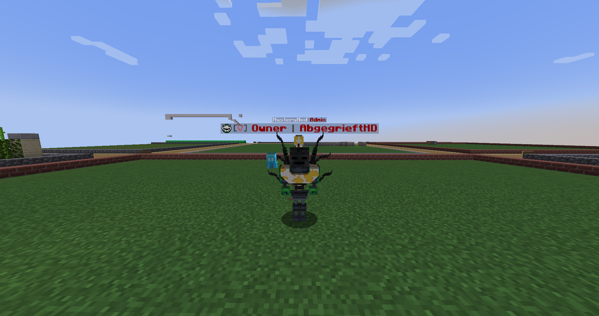

# 🦝 MysteryMod Fabric

### Was ist Mystery Mod

MysteryMod ist die Partner-Mod von GrieferGames. Sie fügt einige Cosmetics & Emotes hinzu, welche alle Nutzer dieser Mod untereinander sehen können. Außerdem verfügt sie über einige auf Citybuild zugeschnittene Features:

\- Cosmetics, Emotes & Cloaks

\- Modifiziertes Chat-System (Chat-Filter, Auto-Text, Chat-Kategorien,...)

\- In-game-GUI (Anzeige von FPS, Ping, Koordinaten,...)

\- Integration des ScammerRadars & der Trusted MM Liste (optionale Features)

\- Fake Money Check

\- TeamSpeak-Integration

\- Möbel ([CustomBlocks](customblocks.md))

Die Nutzung dieser Mod ist selbstverständlich freiwillig. Ihr könnt mit jedem beliebigen (erlaubten) Client auf GrieferGames spielen.


Hier zum Download: https://mysterymod.net/download



Solltet weitere Hilfe benötigt werden, kann sich gerne auf dem [MysteryMod-Discord](https://discord.gg/RXq56TTPYE) gemeldet werden.&#x20;


### MysteryMod als Fabric-Mod

Die Fabric-Version von MysteryMod ist etwas anders als die 1.8-Version. Sie ist darauf ausgelegt, mit möglichst vielen anderen Fabric-Mods kompatibel zu sein und hat eine bessere Performance & Start-Up-Time.

### Anleitung:

Um MysteryMod Fabric verwenden zu können, müsst ihr vorher [Fabric ](https://fabricmc.net/use/installer/)installieren  - ihr ladet die Datei herunter, führt sie aus und drückt dann auf den Button “Install”.

Zusätzlich wird die Mod “[Fabric API](https://www.curseforge.com/minecraft/mc-mods/fabric-api)” benötigt.

Sobald die Mods “Fabric API” und “MysteryMod” installiert sind, zieht ihr diese einfach in euren .minecraft-Ordner und dort in den mods-Ordner.

Sind diese Schritte getan, könnt ihr einfach wie gewohnt den Minecraft-Launcher öffnen, dort die Fabric-Installation auswählen und das Spiel starten.

### Unsere Empfehlungen:

Um ingame eine vereinfachte Übersicht über eure installierten Mods zu haben, empfehlen wir euch die Mod “[Mod Menu](https://modrinth.com/mod/modmenu)” .&#x20;

Ihr habt nun auch die Möglichkeit, Litematica in Kombination mit MysteryMod zu verwenden. Dazu müsst ihr [Litematica](https://www.curseforge.com/minecraft/mc-mods/litematica)  & die Mod-Bibliothek [MaLiLib ](https://www.curseforge.com/minecraft/mc-mods/malilib)herunterladen.

Um Shader verwenden zu können, benötigt ihr “[Sodium](https://modrinth.com/mod/sodium)” und “[Iris Shaders](https://modrinth.com/mod/iris)” &#x20;


OptiFine bietet sich leider nicht als Shader-Loader an, da es dort erhebliche Rendering-Probleme gibt.


Wenn ihr euren Account wechseln, dafür aber nicht das Spiel neustarten wollt, ist die Mod In-Game [Account Switcher](https://www.curseforge.com/minecraft/mc-mods/in-game-account-switcher) genau das richtige für euch.

Eine sehr beliebte Funktion von MysteryMod war auch das “Kartenvorschau” Feature. Diese bekommt ihr durch die Mod “[Map Tooltip](https://www.curseforge.com/minecraft/mc-mods/map-tooltip)” zurück.
