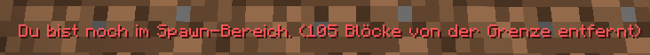

# 🚩 Spielstart und erste Schritte

### Herzlich Willkommen auf GrieferGames - Cloud-Netzwerk

Du hast dich also auf unseren [Server verbunden](../../auf-den-server-joinen/) und in unserer Lobby entschieden, auf unserem Cloud-Netzwerk zu starten.&#x20;

Eine Übersicht über die grundlegenden Befehle zum Start findest du auf den Karten rund um den Spawn. Zusätzlich kannst du die wichtigsten Befehle auch jederzeit über den Befehl `/anfang` abrufen.

Der erste Schritt zu deinem Spielerfolg ist ein eigenes Grundstück (Plot) zu beanspruchen. Dies kannst du zu Beginn über den Befehl `/plot auto` durchführen.&#x20;

Möchtest du stattdessen ein Grundstück an einer bestimmten Stelle wie z.B. in der Nähe eines Freundes haben, dann kannst du nach einem freien Grundstück in der Umgebung suchen, dich darauf stellen und es mit dem Befehl `/plot claim` für dich beanspruchen.

Auf deinem Grundstück kannst nur du bauen und mit Blöcken interagieren. Dies kannst du durch Einstellungen der Grundstücks-Rechte ändern. Für den Anfang empfehlen wir dir dein Grundstück alleine zu nutzen, bis du dich zurechtgefunden hast.

Beim ersten Betreten des Netzwerk erhältst du auch ein Starterpaket aus verschiedenen Items, welches in deinem Inventar ist. Du kannst diese Items verwenden, um dich grundlegend auszurüsten, Werkzeuge herzustellen und deine nächsten Schritte vorzubereiten.

Um an weiteren Materialien zu kommen, kannst du nun über `/warp farmwelt` in die Farmwelt gelangen. Über das Menü kannst du dich dann entscheiden, ob du in der Overworld, dem Nether oder dem End farmen möchtest. Pass dabei auf, dass PvP in den Farmwelten aktiviert ist. Das heißt andere Spieler können _(und werden)_ dich bei gegebener Situation töten.&#x20;

Sobald du in der Farmwelt angekommen bist, musst du erst einmal, ungefähr 130 Blöcke vom Spawn weglaufen, da der Bereich um den Spawn-Punkt geschützt ist. Eine Anzeige, wie viele Blöcke du von der Grenze des Spawn-Bereiches zur "freien" Farmwelt entfernt bist, erscheint im Bildschirm.

<figure><figcaption></figcaption></figure>

Du kannst dir auch einen eigenen Teleportpunkt über `/sethome <NAME>` setzen, um nicht immer wieder vom Spawn aus laufen zu müssen. Mit `/home <NAME>` kommst du jederzeit wieder dort hin.

Um zu deinem Grundstück zurück zu kommen, kannst du jederzeit den Befehl `/plot home` verwenden. Sobald du mehrere Grundstücke hast, kannst du diese auch über die Befehle `/plot home 1`, `/plot home 2`, etc. erreichen.

Deine gefarmten Materialien kannst du nun auf deinem Grundstück unterbringen. Nutze hierfür Kisten, welche du aus Holz herstellen kannst. Um Gegenstände herzustellen, kannst du dir eine Werkbank bauen und auf deinem Grundstück aufstellen oder jederzeit den Befehl `/craft` verwenden, um eine mobile Werkbank zu öffnen.

Wenn du dir bei einem Rezept unsicher bist, kannst du alle Rezepte über das Rezeptbuch in der Werkbank oder unter dem Befehl `/craft` aufrufen und verwenden.&#x20;

Für mehr Befehle, kannst du dir unsere Befehlsübersicht anschauen. Möchtest du mehr Informationen zu Grundstücken und deren Einstellungen, findest du diese hier.
