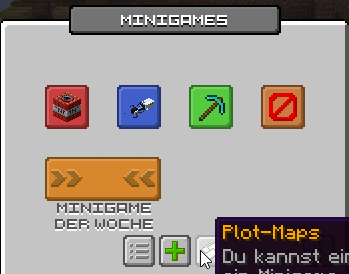

# 🗺 Karten erstellen

Jeder Spieler hat die Möglichkeit seine eigenen Minigame-Karten zu erstellen, zu spielen und sogar für alle Spieler einzureichen.

<figure><figcaption></figcaption></figure>


Im Folgenden finden sich die allgemeinen Informationen und eine Anleitung zum Erstellen von Plot-Maps. Für spielbezogene Anforderungen und Infos sollte die entsprechende Seite des Spiels besucht werden.


## Die Vorbereitung

Um eine neue Karte für ein Minigame zu erstellen, sollte man sich zuerst informieren, welche Anforderungen die Minigame-Maps haben. Wir versuchen die Anforderungen immer so gering und so einfach wie möglich zu halten.

### Größe des Plots

Bevor man also startet zu bauen, sollte man sich Informieren, welche Plot-Größe für das Minigame möglich bzw. benötigt ist. Diese kann je nach Minigame variieren.

Informationen zur Plot-Größe befinden sich in der Unterseite des Minigames oder im Menü, um eine neue Map zu erstellen.

<figure><figcaption>
Menüführung zur Plot-Größe
</figcaption></figure>

## Minigame-Markierungen


Jedes Minigame kann zusätzlich zu den Standardmarkierungen noch Weitere besitzen.


Für ein Minigame werden ein paar Informationen benötigt, wie z.B. wo sollen die Spieler spawnen, gibt es einen Bereich "vor dem Spiel" und gibt es Bezugspunkte für das Spiel selbst.&#x20;

Diese Punkte werden bei den Minigames mit Blöcken markiert, welche im späteren Verlauf durch das System ersetzt werden.

###  **Spender (Dropper)**

Mit Spendern werden die Spawn-Punkte für die Spieler markiert. Je nach Minigame ist ein Spawnpunkt erforderlich oder eine Vielzahl an Spawn-Punkten. **Die Ausrichtung der Spender gibt dabei die Blickrichtung der Spieler beim Spawn an.**


Wenn mehrere Spawn-Punkte gesetzt werden können, wird meist anhand der Spawn-Anzahl die **mögliche Spielerzahl** der Map berechnet.


###  Werfer (Dispenser)

Für die meisten Spiele kann ein Vorab-Spawnpunkt gesetzt werden. An diesem Punkt spawnen die Spieler beim joinen auf den Server und warten dort auf den Start des Spiels. **Die Ausrichtung der Werfer gibt dabei die Blickrichtung der Spieler beim Spawn an.**

###  Sicherheitskamera

Durch das Platzieren von Sicherheitskameras in der Map können Zuschauer-Punkte gesetzt werden. Als Zuschauer eines Minigames kann man sich zwischen den Kameras hin und her bewegen, um dem Spiel beizuwohnen.

## Plot-Map-Menü

Das Plot-Map-Menü befindet sich im Hauptmenü der `/minigames` unter  **Plot-Maps**. In der Liste findest du deine erstellten Maps und deren Status. Hier werden auch fehlende Markierungen oder Probleme mit deiner Map angezeigt.

<figure><figcaption>
Plot-Map-Informationen
</figcaption></figure>

* **Bereit:** Gibt an, ob die Map spielbereit ist. Ist eine Map nicht spielbereit, wird diese ggf. noch vorbereitet oder enthält Fehler.
* **Bewertung:** Hier ist die Zusammenfassung deiner Map-Bewertungen zusehen, wenn die Map bereits bewertet wurde.
* <mark style="color:red;">**Fehler:**</mark> Hier werden Fehler der Map angezeigt, welche beim Generieren der Map festgestellt wurden. Beispiel: 
* **Community-Map:** Zeigt an, ob deine Map als Community-Map für alle verfügbar ist bzw. wie der Status deiner Einsendung ist.

### Neue Map einreichen / Map aktualisieren

Um eine neue Map einzureichen oder eine eingereichte Map zu aktualisieren, drücke im Plot-Map-Menü auf  **Neue Map erstellen**.

<figure><figcaption>
Ansicht Neue Map erstellen
</figcaption></figure>

Wähle dort als erstes das Spiel aus, indem du auf das Spiel-Icon klickst. Beim Klick wird zum nächsten Spiel umgeschaltet. Im zweiten Slot wird die Information zur Grundstücksgröße angezeigt. Der Dritte gibt an, ob die Karte erstellt werden kann oder nicht.

<figure><figcaption>
Fehlermeldung beim Plot erstellen
</figcaption></figure>

Kannst du die Karte erstellen, wird die Anzeige grün und mit einem Klick auf den grünen Knopf wird die Erstellung bestätigt.

<figure><figcaption>
Button zum Grundstück als Map erstellen
</figcaption></figure>

Danach kopiert das Minigame-System dein Plot, welches durch zwei Chatausgaben angezeigt wird:

<figure><figcaption>
Chatausgabe Map erstellen
</figcaption></figure>

Sobald die Minigame-Map erstellt wurde, beginnt das System im Hintergrund zu arbeiten und die Map vorzubereiten. Der Status kann dann im Plot-Map-Menü verfolgt werden.


**Achtung:** Es kann zu jedem Grundstück nur eine Karte pro Minigame existieren. Die Karten werden anhand der Plot-ID identifiziert und somit kann die Karte auch nach dem ersten Einreichen durch "Map neu erstellen" aktualisiert werden.



Die Verbindung zwischen Plot und Minigame-Map wird bei erfolgreich angenommenen Community-Maps aufgehoben. Ist eine Map als Community-Map angenommen, kann diese nicht mehr vom Ersteller bearbeitet werden. _Das Plot kann dann jedoch erneut verwendet werden._

