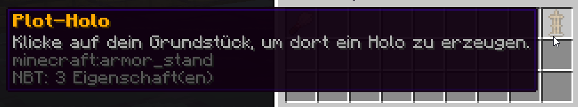
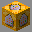
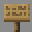
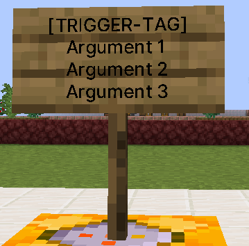
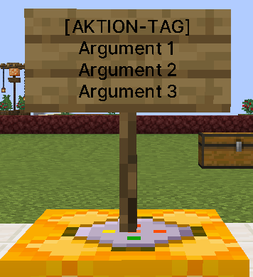

# Escape

Escape ist ein vielseitiges Minispiel, welches für verschiedene kleine Spielmodi verwendet werden kann. Um ein paar Beispiele zu geben:

* Escape-Rooms
* Jump & Run
* Parcours

Das Spielprinzip von Escape sieht vor, dass ein Spieler an einem Punkt startet und das Ziel erreichen muss. Welche Hindernisse oder Aufgaben dem Spieler dabei gesetzt werden, ist dem Erbauer der Karte überlassen.

## Voraussetzungen in Escape 

Im Modus Escape gelten folgende Bedingungen für die Spieler, die beim Bau der Map berücksichtigt werden müssen:

* Jeder Spieler befindet sich im [**Minecraft Adventure Mode**](escape.md#\_4hgifu6674mu)
* Es kann mehrere End-Punkte geben
* Das Spiel endet, sobald **ein Spieler** den Endpunkt erreicht hat
* Die Spieler haben keine automatische Nachtsicht. Die Map kann also nach eigenem Ermessen ausgeleuchtet werden.
* Wenn mehrere Spawn-Punkte gesetzt sind, spawned jeder Spieler an einem anderen Spawn-Punkt
* Es werden alle Inhalte von Kisten, Büchern etc. übernommen. Auch Karten sind möglich. Es ist jedoch nicht möglich mit Karten zu Interagieren.

## Was ist Adventure Mode? 

Im Adventure Mode ist ein Spieler eingeschränkt in dem, was er machen kann. Allgemein ist der Modus sehr ähnlich zum **Survival-Mode (Überlebensmodus)**. Als Spieler hat man Hunger, erleidet Schaden von Ihrer Umwelt und kann gegebenenfalls auch sterben. Jedoch gibt es einengroßen Unterschied: **Man kann (grundsätzlich) keine Blöcke abbauen oder platzieren!** Es sei denn, ein Werkzeug oder Item hat einen bestimmten NBT Tag, dieser besagt, welcher Block bzw. welches Item damit abgebaut werden kann. Dieses Tool/Item kann nichts anderes zerstören.

Bei Blöcken oder Items sagt der NBT-Tag, worauf diese platziert werden können.

.png>) 

Interagieren ist im Adventure Mode möglich. Somit können Türen, Falltüren, Knöpfe, Kisten usw. einfach verwendet werden. Dies ermöglicht auch das Einschalten einer Redstone Anlage. Zusätzlich steht dem Spieler auch die Crafting-Funktion, um Items zu erstellen, zur Verfügung.

Durch das Verwenden des Adventure Modes, kann man sicherstellen, dass gewisse Bereiche oder ganze Maps nicht zerstört werden können. Dieser Modus wird auf GrieferGames für alle Minigames verwendet, um so kein Zerstören der Mini-Game Maps zu gewährleisten.

## Ziel-Markierungen 

Ziele sind im Escape-Modus über  **Feinwägeplatten** (Gold-Druckplatte) festgelegt. Sobald ein Spieler eine solche Platte betritt, ist die Map abgeschlossen.

_Anders als bei anderen Markierungen bleiben die Platten bestehen und sind im Spiel als Ziel erkennbar._

## Adventure-Mode-Creator 

Da die Items mit den Adventure-Tags nicht einfach so erstellt werden können, steht auf dem Server der Adventure-Mode-Creator unter `/adventuremodecreator` oder kurz `/amc` zur Verfügung. Mit diesem Tool könnt ihr die Adventure-Items komfortabel erstellen.


Die Adventure-Tags gelten auf den Citybuild- und Farm-Servern nicht, da die Spieler nicht im Adventure-Spielmodus sind. Ihr könnt die erstellten Blöcke also ohne Einschränkung platzieren oder abbauen.


### Auswahl des Items 

.png>)

Als erstes müsst ihr das **Tool** oder den **Block** aus eurem Inventar auswählen, auf welchen Adventure-Tags hinzugefügt werden sollen. Auf Tools kann eine Abbauoption hinzugefügt werden und auf Blöcke eine Platzierungsoption.


Wählt ihr ein zweites Mal das gleiche Tool, werden die vorhandenen Informationen erneut geladen.


### Hinzufügen der Blöcke 

.png>)

Wählt nun im **Abbau- oder Platzierungs-Editor** die gewünschten Blöcke aus dem Inventar. Diese erscheinen dann im oberen Inventar. Wollt ihr einen Block wieder entfernen, könnt ihr diesen im oberen Inventar anklicken und damit entfernen.

### Item erstellen 

Um nun das Item zu erstellen klickt auf den Bestätigen-Knopf (unten rechts) und das ausgewählte Item erhält die neuen Adventure-Informationen.


Das Item wird aktualisiert. Ihr erhaltet kein neues Item mit den neuen Informationen.


Nun könnt ihr das Item z.B. in einer Kiste o.ä. in eurer Map platzieren.


Möchtet ihr die Tags wieder entfernt haben, könnt ihr über den Creator die Blöcke einfach entfernen und der Tag wird entsprechend wieder entfernt.


## Escape Command System 

Da viele Singleplayer Escape-Maps gerne Command-Blöcke zum Erweitern der Möglichkeiten nutzen und wir diese Option auf GrieferGames nicht bieten können, gibt es hierfür ein eigenes Escape-Command-System.

### Platzieren von Befehlen 

.png>)

Befehle auf der Karte können mit einem  **goldenen Befehlsblock** (CustomBlock, Ersatzblock Befehlsblock) und einem darauf stehenden **Schild** erstellt werden.


Die platzierten Blöcke & Schilder werden nicht ersetzt, diese sollten also außerhalb des Sichtfeldes der Spieler platziert werden


Auf der Vorderseite des Schilds befindet sich ein “Trigger” und auf der Rückseite eine “Aktion”.


Das System erkennt automatisch, wenn die Anweisungen vertauscht sind und führt diese trotzdem entsprechend aus.


### <mark style="color:orange;">Command-Trigger</mark> 

Command-Trigger sind definierte Schlagworte, welche eine Aktion beschreiben, die durch den Spieler oder eine Mechanik ausgelöst wird. Die Trigger werden auf der Vorderseite des Schildes wie folgt notiert:

<figure><figcaption>
Trigger-Tag Beispielschild
</figcaption></figure>

Die folgenden Trigger stehen zur Verfügung:

| Trigger-Tag | Beschreibung                                                                                                                                                                                                                    | Argument 1                                                                                      | Argument 2                                                                     |
| ----------- | ------------------------------------------------------------------------------------------------------------------------------------------------------------------------------------------------------------------------------- | ----------------------------------------------------------------------------------------------- | ------------------------------------------------------------------------------ |
| \[BREAK]    | Beim Abbau eines Blockes                                                | Abgebautes [Material](https://hub.spigotmc.org/javadocs/bukkit/org/bukkit/Material.html)        | _<mark style="color:green;">(optional)</mark>_ relative Koordinaten des Blocks |
| \[CRAFT]    | Beim Herstellen eines Items durch Crafting                              | Hergestelltes [Material](https://hub.spigotmc.org/javadocs/bukkit/org/bukkit/Material.html)     | --                                                                             |
| \[PLACE]    | Beim Platzieren eines Blockes                                                                                                                       | Platziertes [Material](https://hub.spigotmc.org/javadocs/bukkit/org/bukkit/Material.html)       | _<mark style="color:green;">(optional)</mark>_ relative Koordinaten des Blocks |
| \[KILL]     | Beim Töten eines Monsters                                               | Getöteter [Mob-Typ](https://hub.spigotmc.org/javadocs/bukkit/org/bukkit/entity/EntityType.html) | --                                                                             |
| \[REDSTONE] | Wird durch ein Redstone-Signal ausgelöst                                                                                                                                                                                        | _<mark style="color:green;">(optional)</mark>_ Benötigte Redstone-Power                         | --                                                                             |
| \[VARIABLE] | Wenn eine Variable durch die <mark style="color:purple;">**SETVARIABLE**</mark><mark style="color:purple;">-Action</mark> geändert wird.                                                                                        | Variablen-Name                                                                                  | _<mark style="color:green;">(optional)</mark>_ Erforderlicher Wert             |
| \[USETIPP]  | Wenn ein Tipp genutzt wird.                                                                                                                                                                                                     | Tipp-Tag                                                                                        | --                                                                             |
| \[MOVE]     | 
Wenn sich ein Spieler auf einen bestimmtem Block bewegt.   <mark style="color:red;">Achtung:</mark> Es muss Argument 3 gesetzt werden.
 | Relative Koordinaten zu einem Block                                                             | --                                                                             |


Das **Argument 3** (letzte Zeile) gibt bei allen Triggern an, wie oft der Trigger ausgelöst werden darf. Es kann auch `%player%` verwendet werden, dann kann der Trigger so oft ausgeführt werden, wie Spieler in der Lobby sind.\
\
_Wird keine Zahl angegeben, kann der Trigger beliebig oft ausgeführt werden._



Trigger welche den Befehlsblock betreffen, wie z.B. **\[REDSTONE]** müssen am Befehlsblock ausgelöst werden, nicht am Schild.


### <mark style="color:purple;">Command-Aktionen</mark> 

Command-Aktionen sind definierte Schlagworte, welche eine Aktion beschreiben, die als Reaktion auf einen Trigger ausgeführt werden soll. Die Aktionen werden auf der Rückseite des Schildes wie folgt notiert:

Die folgenden Aktionen stehen zur Verfügung:

| Action-Tag       | Beschreibung                                                                                                                                                                                                                              | Argumente                                                                                                                                                                                                                                                                                        |
| ---------------- | ----------------------------------------------------------------------------------------------------------------------------------------------------------------------------------------------------------------------------------------- | ------------------------------------------------------------------------------------------------------------------------------------------------------------------------------------------------------------------------------------------------------------------------------------------------ |
| \[BLOCK]         | Setzt einen Block                                                                                                                                                                                                                         | 
1: relative Koordinate 2: <a href="https://hub.spigotmc.org/javadocs/bukkit/org/bukkit/Material.html">Material</a>
                                                                                                                                                                     |
| \[BLOCKROTATION] | Rotiert einen Block                                                                                                                                                                                                                       | 
1: relative Koordinate 2: 0 = Uhrzeigersinn, 1 = gegen den Uhrzeigersinn
                                                                                                                                                                                                               |
| \[TELEPORT]      | 
Teleportiert Spieler <em><mark style="color:orange;">Benötigt</mark></em>  <em><mark style="color:orange;">für einen Speziellen Spieler</mark></em>
 | 
1: Ziel (relative Koordinaten) 2: <mark style="color:green;">(optional)</mark> Richtung als Zahl 3: <mark style="color:green;">(optional)</mark> Alle Spieler 1/0
                                                                                                                   |
| \[PLACEON]       | Verändert das Item des Triggers und fügt die Option zum Platzieren hinzu. _<mark style="color:orange;">Benötigt</mark>_                                        | 
1: <a href="https://hub.spigotmc.org/javadocs/bukkit/org/bukkit/Material.html">Material</a> 2: <a href="https://hub.spigotmc.org/javadocs/bukkit/org/bukkit/Material.html">Material</a> 3: <a href="https://hub.spigotmc.org/javadocs/bukkit/org/bukkit/Material.html">Material</a>
 |
| \[CANBREAK]      | 
Verändert das Item des Triggers und fügt die Option zum Abbauen hinzu. <em><mark style="color:orange;">Benötigt</mark></em> 
                         | 
1: <a href="https://hub.spigotmc.org/javadocs/bukkit/org/bukkit/Material.html">Material</a> 2: <a href="https://hub.spigotmc.org/javadocs/bukkit/org/bukkit/Material.html">Material</a> 3: <a href="https://hub.spigotmc.org/javadocs/bukkit/org/bukkit/Material.html">Material</a>
 |
| \[ENCHANT]       | 
Verändert das Item des Triggers und fügt ein Enchantment hinzu. <em><mark style="color:orange;">Benötigt</mark></em> 
                                | 
1: Enchantment 2: <em><mark style="color:green;">(optional)</mark></em> Level
                                                                                                                                                                                                          |
| \[RENAME]        | 
Verändert das Item des Triggers und benennt es um. <em><mark style="color:orange;">Benötigt</mark></em> 
                                             | 1: Neuer Name                                                                                                                                                                                                                                                                                    |
| \[MOB]           | Spawned einen Mob / Mobs                                                                                                                                                                                                                  | 
1: <a href="https://hub.spigotmc.org/javadocs/bukkit/org/bukkit/entity/EntityType.html">Mob-Typ</a> 2: relative Koordinaten 3: <em><mark style="color:green;">(optional)</mark></em> Menge
                                                                                          |
| \[SETVARIABLE]   | Setzt eine Variable für die Nutzung des <mark style="color:orange;">**VARIABLE**</mark><mark style="color:orange;">-Triggers</mark>                                                                                                       | 
1: Variablen-Name 2: Wert oder Wertänderung (+10 / -10)
                                                                                                                                                                                                                                |
| \[SOUND]         | Spielt einen Sound ab                                                                                                                                                                                                                     | 
1: <a href="https://hub.spigotmc.org/javadocs/bukkit/org/bukkit/Sound.html">Sound</a> 2: <em><mark style="color:green;">(optional)</mark></em> relative Koordinaten 3: <em><mark style="color:green;">(optional)</mark></em> Lautstärke (1-10)
                                      |
| \[TIPP]          | Fügt einen verfügbaren Tipp dem Spiel hinzu.                                                                                                                                                                                              | 
1: Tipp-Tag 2: relative Koordinaten zu einer Kiste, die Tipp-Items enthält 3: <em><mark style="color:green;">(optional)</mark></em> Verzögerung in Sekunden, bis der Tipp verfügbar ist
                                                                                             |
| \[CANCELTIPP]    | Entfernt einen verfügbaren Tipp wieder.                                                                                                                                                                                                   | 1: Tipp-Tag                                                                                                                                                                                                                                                                                      |


Argumente die **Koordinaten** angeben, müssen immer **relativ zur Position des Befehlsblocks** angegeben werden und nicht in Citybuild-Coordinaten. Dieses gilt für X-, Y- und Z-Achse.\
\
**Beispiel:** _Ist die gewünschte X-Koordinate auf dem CB 254 und der Befehlsblock befindet sich auf CB-X-Koordinate 200 ist der einzutragende Wert 54._


## Das Tipp-System

In schwierigen Situationen ist manchmal ein Tipp sehr wertvoll, um ein Rätsel zu lösen oder den nächsten Schritt zu erkennen.

Über die Trigger gibt es die Möglichkeit Tipps in das Spiel einfließen zu lassen.&#x20;

### Einen Tipp erstellen

Um einen Tipp zu erstellen, benötigt es lediglich einen Command mit der Aktion <mark style="color:purple;">\[TIPP]</mark>. Dort wird eine Kiste in relativen Koordinaten angegeben. Den Inhalt dieser Kiste erhält der Spieler, wenn der den Tipp mit dem Befehl `/tipp` abruft.&#x20;


Die Kiste wird beim Abrufen des Tipps geleert. \
_Es ist also möglich eine im Rätsel verwendete Kiste zu verwenden._



Es können alle Arten von "Kisten" verwendet werden. Dieses gilt auch für Trichter etc.


### Hintergrund-Infos zum Tipp-System

Es gibt immer nur einen verfügbaren Tipp. Der letzte Tipp, welcher aktiviert wurde (sowohl direkt, als auch mit Verzögerung) ist für die Spieler verfügbar.

Wurde der Tipp verwendet, ist kein Tipp verfügbar, bis die Verzögerung eines Tipps abläuft oder ein weiterer Tipp aktiviert wird.


**Tipp-Tipp:** Über den Trigger <mark style="color:orange;">\[USETIPP]</mark> können Tipp-Ketten erstellt werden, welche nur beim Verwenden des vorherigen Tipps ausgelöst werden.

